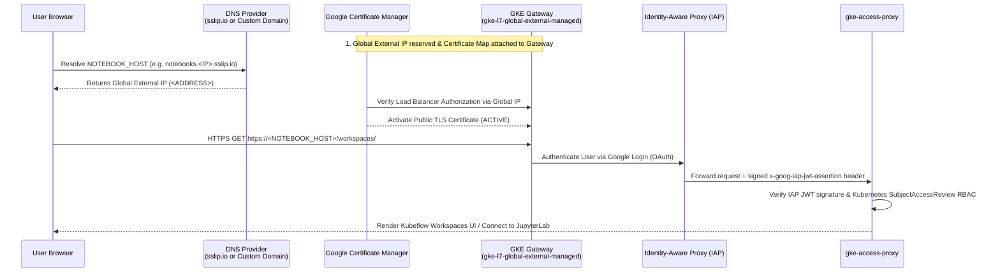

# Deploying Standalone Kubeflow Workspaces, Trainer, & Spark Operator on GKE (No Istio)

This guide provides a clear, step-by-step walkthrough for deploying **Standalone Kubeflow Workspaces (Notebooks v2)**, **Kubeflow Trainer (v2)**, and **Kubeflow Spark Operator** on Google Kubernetes Engine (GKE) **without depending on Istio**.

Instead of Istio service mesh, ingress gateways, and sidecars, this standalone architecture uses native Google Cloud and Kubernetes primitives:
- **GKE Gateway API (`gke-l7-global-external-managed`)**: Google-managed global external HTTPS load balancing.
- **Google Certificate Manager**: Automated public TLS certificates using Load Balancer Authorization.
- **Identity-Aware Proxy (IAP)**: Google authentication and identity assertion at the edge.
- **GKE Access Proxy (`gke-access-proxy`)**: Validates signed IAP JWT assertions, enforces per-request Kubernetes `SubjectAccessReview` RBAC checks, routes HTTP and WebSocket connections to workspaces, and supports optional Kubernetes-minted connection tokens for the VS Code Jupyter extension.
- **Kubernetes NetworkPolicy**: Strictly protects Workspace pods (`gke-tenant-ingress`) so **only `gke-access-proxy` and `workspaces-controller` can reach Workspace pods** (no direct pod-to-pod access to notebooks), while a separate scoped policy (`gke-tenant-workloads-ingress` excluding `notebooks.kubeflow.org/workspace-name`) allows non-workspace workload pods in `${TENANT_NAMESPACE}` (Spark driver/executors, multi-host TPU `TrainJob` hosts, and inference pods) to communicate within `${TENANT_NAMESPACE}`.

---

## Architecture Comparison & Document Guide

| Feature | Standalone GKE Deployment (`gke-notebook/gke`) | Community Distribution (`kubeflow-notebooks/gke`) |
| --- | --- | --- |
| **Service Mesh / Ingress** | **No Istio** — Native GKE Gateway API (`gke-l7-global-external-managed`) | Istio IngressGateway + Istio CNI + mTLS sidecars |
| **Public HTTPS / TLS** | Google Certificate Manager (Load Balancer Authorization) | `cert-manager` + Let's Encrypt ACME HTTP-01 solver |
| **Authentication** | Google Identity-Aware Proxy (IAP) + Signed JWT verification | Dex OIDC + `oauth2-proxy` |
| **Authorization** | Access Proxy + Kubernetes `SubjectAccessReview` RBAC | Istio `AuthorizationPolicy` + Kubeflow Profiles |
| **Workloads Supported** | Kubeflow Workspaces (v2), Kubeflow Trainer (v2), Spark Operator | Full Kubeflow Community Distribution |

> [!TIP]
> **Which document should I read?**
> - **[USER_GUIDE.md](USER_GUIDE.md) (this document)**: The authoritative, step-by-step customer deployment guide with configuration options (domain vs. `sslip.io`, Google-managed OAuth vs. custom OAuth), distributed Spark + TPU setup, and VS Code desktop connection instructions.
> - **[CODELAB.md](CODELAB.md)**: A streamlined quickstart walkthrough using the automation scripts (`deploy_standalone.sh`, `build_jupyterlab.sh`, `cleanup_standalone.sh`) along with the historical pilot verification record.
> - **[DESIGN.md](DESIGN.md)**: Detailed security architecture and trade-offs of the Istio-free access proxy.

### Automated Deployment Scripts
To streamline the entire installation, use the scripts in this directory:
- **[`deploy_standalone.sh`](deploy_standalone.sh)**: Automates API enablement, Gateway controller setup, `cert-manager` installation, core image builds, Certificate Manager setup (with automatic `sslip.io` fallback if you don't have a domain), IAP audience discovery, Kubeflow Trainer + Spark Operator installation, tenant RBAC, and GCS Workload Identity IAM bindings.
- **[`build_jupyterlab.sh`](build_jupyterlab.sh)**: Builds and pushes custom JupyterLab (CPU, GPU, TPU) and Spark 4.0.1 images (bundled with `examples/distributed_tpu_example.ipynb`) and registers the `jupyterlab` `WorkspaceKind` and GPU/TPU `ComputeClasses`.
- **[`cleanup_standalone.sh`](cleanup_standalone.sh)**: Cleanly tears down deployed resources.

---

## 1. Prerequisites & Cluster Setup

### Required Tools
Ensure the following tools are installed on your workstation:
- `gcloud` CLI with `gke-gcloud-auth-plugin`
- `kubectl` (v1.28+)
- `docker` (with `linux/amd64` build support)
- `go` (v1.25+)
- `jq`, `curl`, `sha256sum`, `envsubst` (from `gettext`)

### Create or Select a GKE Cluster
You need a VPC-native GKE cluster with **Dataplane V2** (`ADVANCED_DATAPATH`), **Workload Identity Federation for GKE**, **HTTP Load Balancing**, **GCE Persistent Disk CSI Driver**, and **Gateway API (`--gateway-api=standard`)** enabled.

If you do not have a cluster yet, create one using `gcloud`:

```bash
export PROJECT="your-gcp-project-id"
export CLUSTER="kubeflow-notebooks"
export LOCATION="us-central1-c"   # Zone or region where you have TPU / GPU quota
export REGION="us-central1"       # Region for Artifact Registry and GCS bucket

gcloud container clusters create "${CLUSTER}" \
  --project="${PROJECT}" \
  --location="${LOCATION}" \
  --enable-pod-snapshots `# Required for Pause & Resume` \
  --enable-dataplane-v2 `# Required: Enforces Kubernetes NetworkPolicies` \
  --gateway-api=standard `# Required: Enables GKE Gateway API controller` \
  --workload-pool="${PROJECT}.svc.id.goog" `# Required: Enables Workload Identity for GCS access` \
  --workload-metadata=GKE_METADATA \
  --addons=HttpLoadBalancing,GcePersistentDiskCsiDriver,GcsFuseCsiDriver \
  --num-nodes=1 \
  --machine-type=e2-standard-4 \
  --enable-image-streaming

# Optional: Create an autoscaling CPU node pool for Spark executors and inference pods
gcloud container node-pools create cpu-autoscaling-pool \
  --cluster="${CLUSTER}" \
  --project="${PROJECT}" \
  --location="${LOCATION}" \
  --image-type=cos_containerd `# Required for Pause & Resume` \
  --sandbox type=gvisor `# Required for Pause & Resume` \
  --machine-type=e2-standard-4 \
  --enable-autoscaling \
  --min-nodes=0 \
  --max-nodes=3
```

### Set Environment Variables
Run all commands from the root of the repository (`gke-notebook/`). Export your deployment variables:

```bash
set -euo pipefail
export PROJECT="your-gcp-project-id"
export PROJECT_ID="${PROJECT}"
export CLUSTER="kubeflow-notebooks"
export LOCATION="us-central1-c"
export REGION="us-central1"
export PILOT_USERS="user1@example.com,user2@example.com" # Comma- or space-separated Google account emails of users
export TENANT_NAMESPACE="team-a"                  # Example tenant namespace for notebooks & jobs
export REPOSITORY="notebooks"                     # Artifact Registry repository name
export ADDRESS_NAME="notebooks-gke-global"        # Global static external IP name
export CERTIFICATE_NAME="notebooks-gke"
export CERTIFICATE_MAP="notebooks-gke"
export CONTEXT="gke_${PROJECT}_${LOCATION}_${CLUSTER}"
export REGISTRY="${REGION}-docker.pkg.dev/${PROJECT}/${REPOSITORY}"
export TAG="pilot-$(date -u +%Y%m%d%H%M%S)"
export GCS_BUCKET="${TENANT_NAMESPACE}-bucket"              # Shared GCS bucket for distributed_tpu_example.ipynb (Spark ETL & TPU data)
export SNAPSHOT_GCS_BUCKET="${TENANT_NAMESPACE}-snapshots-bucket" # Dedicated GCS bucket for GKE Pod Snapshots (stateful Pause/Resume)
```

Authenticate `kubectl` to your cluster:

```bash
gcloud container clusters get-credentials "${CLUSTER}" \
  --location="${LOCATION}" \
  --project="${PROJECT}"
```

---

## 2. Enable GCP APIs, GKE Gateway Controller, & Cert-Manager

> [!IMPORTANT]
> You **must** enable the required Google Cloud APIs and enable `--gateway-api=standard` on your cluster **before** checking `kubectl get gatewayclasses` or installing Gateway resources.

### Step 2.1: Enable Google Cloud APIs
```bash
gcloud services enable \
  container.googleapis.com \
  compute.googleapis.com \
  artifactregistry.googleapis.com \
  certificatemanager.googleapis.com \
  iap.googleapis.com \
  --project="${PROJECT}"
```

### Step 2.2: Enable & Verify GKE Gateway API Controller
If you created an existing cluster without `--gateway-api=standard`, enable the standard Gateway API controller now and wait for the `gke-l7-global-external-managed` `GatewayClass` to become `Accepted`:

```bash
gcloud container clusters update "${CLUSTER}" \
  --location="${LOCATION}" \
  --project="${PROJECT}" \
  --gateway-api=standard \
  --quiet

# Wait for GKE to register and accept the global external GatewayClass
kubectl --context="${CONTEXT}" wait gatewayclass/gke-l7-global-external-managed \
  --for=condition=Accepted --timeout=10m

# Verify Gateway API and GKE policy CRDs are installed
kubectl --context="${CONTEXT}" get crd \
  gateways.gateway.networking.k8s.io \
  httproutes.gateway.networking.k8s.io \
  gcpbackendpolicies.networking.gke.io \
  healthcheckpolicies.networking.gke.io
```

### Step 2.3: Record Cluster Control Plane Endpoint
Inspect your cluster and record its verified control-plane IP address as `CONTROL_PLANE_CIDR`:

```bash
CONTROL_PLANE_IP=$(gcloud container clusters describe "${CLUSTER}" \
  --location="${LOCATION}" --project="${PROJECT}" \
  --format='value(privateClusterConfig.privateEndpoint,controlPlaneEndpointsConfig.ipEndpointsConfig.privateEndpoint)' | awk '{print $1}')
if [[ -z "${CONTROL_PLANE_IP}" ]]; then
  CONTROL_PLANE_IP=$(gcloud container clusters describe "${CLUSTER}" \
    --location="${LOCATION}" --project="${PROJECT}" \
    --format='value(endpoint)')
fi
export CONTROL_PLANE_CIDR="${CONTROL_PLANE_IP}/32"
echo "CONTROL_PLANE_CIDR: ${CONTROL_PLANE_CIDR}"
```

### Step 2.4: Create Artifact Registry Repository
Create the Docker repository in Artifact Registry if it does not exist:

```bash
gcloud artifacts repositories create "${REPOSITORY}" \
  --project="${PROJECT}" \
  --location="${REGION}" \
  --repository-format=docker || true
```

### Step 2.5: Install Cert-Manager (v1.21.2)
`cert-manager` issues internal TLS certificates for the admission webhooks used by Kubeflow Workspaces, Trainer, and Spark Operator. Install `cert-manager` v1.21.2 if not already present:

```bash
mkdir -p gke/bin
curl -fsSL https://github.com/cert-manager/cert-manager/releases/download/v1.21.2/cert-manager.yaml \
  -o gke/bin/cert-manager-v1.21.2.yaml
printf '%s  %s\n' e03b668ec8675214af6b0a671699d088f2601fa3878e0dbe1b41d3feafd1879f \
  gke/bin/cert-manager-v1.21.2.yaml | sha256sum --check
kubectl --context="${CONTEXT}" apply --server-side \
  --field-manager=notebooks-gke-platform -f gke/bin/cert-manager-v1.21.2.yaml

for component in cert-manager cert-manager-webhook cert-manager-cainjector; do
  kubectl --context="${CONTEXT}" -n cert-manager rollout status \
    deployment/"${component}" --timeout=5m
done
```

---

## 3. Build & Push Application & Custom JupyterLab/Spark Images

### Step 3.1: Build & Push Standalone Workspaces Core Images
Build and push the four standalone core images (`gke-access-proxy`, `gke-frontend`, `gke-controller`, `gke-backend`) and pin their registry digests:

```bash
make -C gke test
gcloud auth configure-docker "${REGION}-docker.pkg.dev" --quiet

docker build --platform=linux/amd64 -t "${REGISTRY}/gke-access-proxy:${TAG}" gke
docker build --platform=linux/amd64 -f gke/frontend.Dockerfile \
  -t "${REGISTRY}/gke-frontend:${TAG}" .
docker build --platform=linux/amd64 -f workspaces/controller/Dockerfile \
  -t "${REGISTRY}/gke-controller:${TAG}" workspaces/controller
docker build --platform=linux/amd64 -f workspaces/backend/Dockerfile \
  -t "${REGISTRY}/gke-backend:${TAG}" workspaces

for component in access-proxy frontend controller backend; do
  docker push "${REGISTRY}/gke-${component}:${TAG}"
done
```

### Step 3.2: Build & Push Custom JupyterLab & Spark Images for `distributed_tpu_example.ipynb`
To run the distributed Spark ETL and Cloud TPU training workflow in [`examples/distributed_tpu_example.ipynb`](examples/distributed_tpu_example.ipynb), build the custom JupyterLab (CPU, GPU, TPU) and Spark 4.0.1 images using [`gke/build_jupyterlab.sh`](build_jupyterlab.sh):

```bash
PROJECT_ID="${PROJECT}" \
REGION="${REGION}" \
REPO_NAME="${REPOSITORY}" \
TENANT_NAMESPACE="${TENANT_NAMESPACE}" \
GCS_BUCKET="${GCS_BUCKET}" \
  bash gke/build_jupyterlab.sh
```
*(Tip: Add `--cloud-build` to build remotely via Google Cloud Build instead of local Docker.)*

---

## 4. Configuration Options: Domain, TLS Certificates, & Google Login (OAuth)

### Part A: Domain & TLS Certificate Configuration Options

The GKE Gateway serves HTTPS using a **Google Certificate Manager** certificate with **Load Balancer Authorization**. You can configure this with or without your own custom domain:



#### Step 4A.1: Reserve Global Static External IPv4 Address
First, reserve a global external IPv4 address for the Gateway:

```bash
gcloud compute addresses create "${ADDRESS_NAME}" --global --ip-version=IPV4 \
  --network-tier=PREMIUM --project="${PROJECT}" || true

export ADDRESS=$(gcloud compute addresses describe "${ADDRESS_NAME}" \
  --global --project="${PROJECT}" --format='value(address)')
echo "Reserved Global External IP: ${ADDRESS}"
```

Now choose **Option A1 (No Domain)** or **Option A2 (Custom Domain)**:

---

#### Option A1: What To Do If You Do Not Have a Domain (`sslip.io` Zero-DNS Setup)
If you do not own a domain name or want an instant, zero-DNS setup, use **[sslip.io](https://sslip.io/)**. Any hostname of the form `notebooks.<IP>.sslip.io` automatically resolves to `<IP>` on public DNS without any configuration:

```bash
export NOTEBOOK_HOST="notebooks.${ADDRESS}.sslip.io"
echo "Using automatic sslip.io hostname: ${NOTEBOOK_HOST}"

# Verify public DNS resolution
getent ahostsv4 "${NOTEBOOK_HOST}"
```

*(Note: When running `./gke/deploy_standalone.sh`, if `NOTEBOOK_HOST` is left unset, the script automatically configures `notebooks.${ADDRESS}.sslip.io` for you.)*

---

#### Option A2: What To Do If You Have Your Own Custom Domain
If you own a custom domain (e.g., `notebooks.example.com`):
1. Set your desired hostname:
   ```bash
   export NOTEBOOK_HOST="notebooks.example.com"
   ```
2. In your DNS provider (Cloud DNS, Route 53, Cloudflare, etc.), create an **A record**:
   - **Name / Host**: `notebooks` (for `notebooks.example.com`)
   - **Type**: `A`
   - **Value**: `${ADDRESS}` (your reserved global external IP)
   - **TTL**: `300` seconds
   *(If using Cloudflare, set proxy status to **DNS only / grey cloud**).*
3. Verify public DNS resolves to `${ADDRESS}` before continuing:
   ```bash
   dig +short "${NOTEBOOK_HOST}"
   ```

---

#### Step 4A.2: Create Google Certificate Manager Certificate & Map Entry
Once `NOTEBOOK_HOST` is set (via either Option A1 or Option A2), create the Certificate Manager certificate and certificate map entry:

```bash
gcloud certificate-manager certificates create "${CERTIFICATE_NAME}" \
  --domains="${NOTEBOOK_HOST}" --project="${PROJECT}"

gcloud certificate-manager maps create "${CERTIFICATE_MAP}" --project="${PROJECT}"

gcloud certificate-manager maps entries create notebooks \
  --map="${CERTIFICATE_MAP}" --certificates="${CERTIFICATE_NAME}" \
  --hostname="${NOTEBOOK_HOST}" --project="${PROJECT}"
```
> [!NOTE]
> Because this certificate uses Load Balancer Authorization (no DNS challenge required), it will remain in `PROVISIONING` state until Step 5 creates the GKE Gateway and attaches the certificate map. Do **not** wait for `ACTIVE` before continuing to Step 5.

---

### Part B: Authentication Configuration Options (Google Login & IAP OAuth)

Identity-Aware Proxy (IAP) authenticates users with Google accounts. Choose **Option B1** or **Option B2** based on whether your users belong to your GCP organization:

| Accounts that will sign in | Recommended OAuth Configuration |
| --- | --- |
| **Google Workspace / Cloud Identity users within the GCP project's organization** | **Option B1: Google-Managed OAuth** (Zero OAuth client or secret needed) |
| **External Google accounts (`@gmail.com`) or users outside the GCP project's organization** | **Option B2: Custom OAuth Client** (Dedicated Web Application OAuth client + Secret) |

#### Option B1: Google-Managed OAuth (Users Within Your GCP Organization)
If the Google accounts signing in belong to the same Google Cloud Organization that owns `${PROJECT}`, leave both `IAP_CLIENT_ID` and `IAP_SECRET_NAME` empty:

```bash
export IAP_CLIENT_ID=""
export IAP_SECRET_NAME=""
```
*(Skip directly to Section 5.)*

#### Option B2: Custom OAuth Client (External / Cross-Organization Users)
Google-managed OAuth only allows users inside the project's organization. If your users are external (e.g., `@gmail.com` or from a different organization):
1. Open [Google Auth Platform Branding](https://console.cloud.google.com/auth/branding) in your project and configure the app name and support email.
2. If using External testing mode, add the emails in `${PILOT_USERS}` to the **Test users** list.
3. Open [Google Auth Platform Clients](https://console.cloud.google.com/auth/clients), create a **Web application** OAuth client named **Notebooks GKE**, and download the JSON file to a private location (e.g. `~/oauth-client.json`).
4. Edit the OAuth client in the Cloud Console and add the exact **Authorized redirect URI** (substituting your `CLIENT_ID`):
   ```
   https://iap.googleapis.com/v1/oauth/clientIds/CLIENT_ID:handleRedirect
   ```
5. Export `IAP_CLIENT_ID` and `IAP_SECRET_NAME`:
   ```bash
   export OAUTH_FILE="/absolute/private/path/oauth-client.json"
   chmod 600 "${OAUTH_FILE}"
   export IAP_CLIENT_ID=$(jq -er '.web.client_id' "${OAUTH_FILE}")
   export IAP_SECRET_NAME="iap-oauth"
   ```

---

## 5. Step-by-Step Deployment

> [!TIP]
> **Automated Execution**: You can execute all of Section 5 automatically by running:
> ```bash
> ./gke/deploy_standalone.sh
> ```
> Or follow the individual steps below to inspect and apply each stage manually.

### Step 5.1: Generate Deployment Plan & Apply Fail-Closed Bootstrap
Resolve the `@sha256:` digests of your built core images and generate the deployment configuration:

```bash
PROXY_IMAGE=$(gcloud artifacts docker images describe "${REGISTRY}/gke-access-proxy:${TAG}" \
  --project="${PROJECT}" --format='value(image_summary.fully_qualified_digest)')
FRONTEND_IMAGE=$(gcloud artifacts docker images describe "${REGISTRY}/gke-frontend:${TAG}" \
  --project="${PROJECT}" --format='value(image_summary.fully_qualified_digest)')
CONTROLLER_IMAGE=$(gcloud artifacts docker images describe "${REGISTRY}/gke-controller:${TAG}" \
  --project="${PROJECT}" --format='value(image_summary.fully_qualified_digest)')
BACKEND_IMAGE=$(gcloud artifacts docker images describe "${REGISTRY}/gke-backend:${TAG}" \
  --project="${PROJECT}" --format='value(image_summary.fully_qualified_digest)')

jq -n --arg cidr "${CONTROL_PLANE_CIDR}" --arg host "${NOTEBOOK_HOST}" \
  --arg certificateMap "${CERTIFICATE_MAP}" --arg addressName "${ADDRESS_NAME}" \
  --arg client "${IAP_CLIENT_ID}" --arg secret "${IAP_SECRET_NAME}" \
  --arg tenant "${TENANT_NAMESPACE}" \
  --arg proxy "${PROXY_IMAGE}" --arg frontend "${FRONTEND_IMAGE}" \
  --arg controller "${CONTROLLER_IMAGE}" --arg backend "${BACKEND_IMAGE}" \
  '{controlPlaneCIDR:$cidr,hostname:$host,certificateMap:$certificateMap,
    addressName:$addressName,iapClientID:$client,iapSecretName:$secret,
    iapAudience:"",tenants:[$tenant],
    images:{proxy:$proxy,frontend:$frontend,controller:$controller,backend:$backend}}' \
  > gke/deployment.local.json

rm -rf gke/rendered/bootstrap
make -C gke plan CONFIG=deployment.local.json OUTPUT=rendered/bootstrap
```

Apply namespaces and NetworkPolicy isolation rules first:

```bash
kubectl --context="${CONTEXT}" apply --server-side --field-manager=notebooks-gke \
  -f gke/rendered/bootstrap/namespaces.json
kubectl --context="${CONTEXT}" apply --server-side --field-manager=notebooks-gke \
  -f gke/rendered/bootstrap/isolation.json
```

If using **Option B2 (Custom OAuth)**, create the Kubernetes Secret containing the OAuth client secret:

```bash
if [[ -n "${OAUTH_FILE:-}" && -n "${IAP_SECRET_NAME:-}" ]]; then
  jq -jr '.web.client_secret' "${OAUTH_FILE}" | \
    kubectl --context="${CONTEXT}" -n kubeflow-workspaces create secret generic "${IAP_SECRET_NAME}" \
      --from-file=client_secret=/dev/stdin
fi
```

Apply CRDs, wait for them to establish, and apply the application and edge manifests:

```bash
jq '{apiVersion,kind,items:[.items[]|select(.kind=="CustomResourceDefinition")]}' \
  gke/rendered/bootstrap/applications.json | \
  kubectl --context="${CONTEXT}" apply --server-side --field-manager=notebooks-gke -f -

kubectl --context="${CONTEXT}" wait --for=condition=Established --timeout=2m \
  crd/workspaces.kubeflow.org crd/workspacekinds.kubeflow.org

kubectl --context="${CONTEXT}" apply --server-side --field-manager=notebooks-gke \
  -f gke/rendered/bootstrap/applications.json
kubectl --context="${CONTEXT}" apply --server-side --field-manager=notebooks-gke \
  -f gke/rendered/bootstrap/edge.json
```
*(Because `iapAudience` is empty during bootstrap, `gke-access-proxy` intentionally exits at startup until Step 5.2 configures the verified IAP audience.)*

---

### Step 5.2: Discover IAP Backend Audience & Finalize Access Proxy
Once GKE creates the global backend service for the proxy's Network Endpoint Group (NEG), discover its numeric backend ID and configure `IAP_AUDIENCE`:

```bash
# 1. Discover the proxy Service's NEG name
NEG_NAME=$(kubectl --context="${CONTEXT}" -n kubeflow-workspaces get service gke-access-proxy \
  -o json | jq -er '.metadata.annotations["cloud.google.com/neg-status"] | fromjson | .network_endpoint_groups["8080"]')

# 2. Match the exact GKE global backend service
MATCHED_BACKEND=$(gcloud compute backend-services list --global --project="${PROJECT}" \
  --format='json(name,id,backends,iap.enabled)' | jq -ce --arg neg "${NEG_NAME}" \
  '[.[] | select(any(.backends[]?; .group | endswith("/networkEndpointGroups/"+$neg)))]
   | if length==1 then .[0] else error("Expected exactly one proxy backend") end')

export BACKEND_SERVICE=$(jq -er '.name' <<< "${MATCHED_BACKEND}")
BACKEND_ID=$(jq -er '.id' <<< "${MATCHED_BACKEND}")
PROJECT_NUMBER=$(gcloud projects describe "${PROJECT}" --format='value(projectNumber)')
export IAP_AUDIENCE="/projects/${PROJECT_NUMBER}/global/backendServices/${BACKEND_ID}"
echo "Discovered IAP Backend: ${BACKEND_SERVICE} (Audience: ${IAP_AUDIENCE})"

# 3. Render ready plan with the verified IAP audience and update the deployment
rm -rf gke/rendered/ready
jq --arg audience "${IAP_AUDIENCE}" '.iapAudience=$audience' \
  gke/deployment.local.json > gke/rendered/deployment.ready.json
make -C gke plan CONFIG=rendered/deployment.ready.json OUTPUT=rendered/ready

kubectl --context="${CONTEXT}" apply --server-side --field-manager=notebooks-gke \
  -f gke/rendered/ready/applications.json
kubectl --context="${CONTEXT}" -n kubeflow-workspaces rollout restart deployment/gke-access-proxy

for component in workspaces-controller workspaces-backend workspaces-frontend gke-access-proxy; do
  kubectl --context="${CONTEXT}" -n kubeflow-workspaces rollout status deployment/"${component}" --timeout=5m
done
```

---

### Step 5.3: Deploy Kubeflow Trainer (v2) & Kubeflow Spark Operator (Standalone, No Istio)
To orchestrate distributed Apache Spark ETL jobs and multi-host Cloud TPU training jobs from inside your standalone Kubeflow Workspace, deploy **Kubeflow Trainer (v2)** and **Kubeflow Spark Operator** directly from [`kubeflow/community-distribution`](https://github.com/kubeflow/community-distribution) (neither component requires Istio):

```bash
export DIST_DIR="/tmp/kubeflow-community-distribution"
if [[ ! -d "${DIST_DIR}" ]]; then
  git clone https://github.com/kubeflow/community-distribution.git "${DIST_DIR}"
fi

# 1. Create Kubeflow core namespaces (kubeflow, kubeflow-system) and aggregated RBAC roles
# Note: We create kubeflow-system and kubeflow directly instead of applying
# ${DIST_DIR}/common/kubeflow-namespace/base because that directory adds Istio-specific
# namespace labels (istio-injection: enabled) and Istio-dependent NetworkPolicies.
kubectl --context="${CONTEXT}" create namespace kubeflow-system --dry-run=client -o yaml | kubectl --context="${CONTEXT}" apply -f -
kubectl --context="${CONTEXT}" create namespace kubeflow --dry-run=client -o yaml | kubectl --context="${CONTEXT}" apply -f -
kubectl --context="${CONTEXT}" apply -k "${DIST_DIR}/common/kubeflow-roles/base"

# 2. Deploy Kubeflow Trainer (v2) & JobSet controller + ClusterTrainingRuntimes (jax-distributed, torch-distributed)
kubectl --context="${CONTEXT}" apply -k "${DIST_DIR}/applications/trainer/overlays" --server-side --force-conflicts || true
kubectl --context="${CONTEXT}" wait --for=condition=Established crd/clustertrainingruntimes.trainer.kubeflow.org --timeout=60s
kubectl --context="${CONTEXT}" wait --for=condition=Established crd/trainingruntimes.trainer.kubeflow.org --timeout=60s
kubectl --context="${CONTEXT}" wait --for=condition=Established crd/trainjobs.trainer.kubeflow.org --timeout=60s
kubectl --context="${CONTEXT}" apply -k "${DIST_DIR}/applications/trainer/overlays" --server-side --force-conflicts
kubectl --context="${CONTEXT}" rollout status deployment/kubeflow-trainer-controller-manager -n kubeflow-system --timeout=180s
kubectl --context="${CONTEXT}" rollout status deployment/jobset-controller-manager -n kubeflow-system --timeout=180s

# 3. Deploy Kubeflow Spark Operator (SparkApplication & SparkConnect CRDs + controller/webhook)
kubectl --context="${CONTEXT}" apply -k "${DIST_DIR}/applications/spark/spark-operator/overlays/kubeflow" --server-side --force-conflicts
kubectl --context="${CONTEXT}" wait --for=condition=Established crd/sparkapplications.sparkoperator.k8s.io --timeout=60s
kubectl --context="${CONTEXT}" wait --for=condition=Established crd/scheduledsparkapplications.sparkoperator.k8s.io --timeout=60s
kubectl --context="${CONTEXT}" wait --for=condition=Established crd/sparkconnects.sparkoperator.k8s.io --timeout=60s
kubectl --context="${CONTEXT}" rollout status deployment/spark-operator-controller -n kubeflow --timeout=180s
kubectl --context="${CONTEXT}" rollout status deployment/spark-operator-webhook -n kubeflow --timeout=180s
```

Verify available cluster training runtimes:
```bash
kubectl --context="${CONTEXT}" get clustertrainingruntime
# Expected output includes: jax-distributed, torch-distributed, deepspeed-distributed, torchtune
```

---

### Step 5.4: Admit Users via IAP & Configure Tenant Workspace (`${TENANT_NAMESPACE}`)
1. **Grant IAP Access to Your Users**:
   ```bash
   for user_email in $(echo "${PILOT_USERS}" | tr ',' ' '); do
     gcloud iap web add-iam-policy-binding --project="${PROJECT}" \
       --resource-type=backend-services --service="${BACKEND_SERVICE}" \
       --member="user:${user_email}" --role=roles/iap.httpsResourceAccessor --condition=None
   done
   ```

2. **Apply Tenant RBAC, ServiceAccount, StorageClass, and ValidatingAdmissionPolicy**:
   Render [`gke/manifests/pilot`](manifests/pilot/kustomization.yaml) with all users in `${PILOT_USERS}` added to the `RoleBinding` and `ClusterRoleBinding` subjects:
   ```bash
   kubectl kustomize --load-restrictor=LoadRestrictionsNone gke/manifests/pilot | \
     python3 -c 'import yaml, json, sys; print(json.dumps({"apiVersion": "v1", "kind": "List", "items": [d for d in yaml.safe_load_all(sys.stdin) if d]}))' | \
     jq --arg users "${PILOT_USERS}" --arg ns "${TENANT_NAMESPACE}" \
       '([ $users | split(",")[] | split(" ")[] | select(length > 0) | {kind: "User", name: ., apiGroup: "rbac.authorization.k8s.io"} ]) as $user_subjects |
        {apiVersion:"v1",kind:"List",items:(.items | map(
         (if .kind=="Namespace" then .metadata.name=$ns else . end) |
         (if .metadata.namespace != null then .metadata.namespace=$ns else . end) |
         (if .kind=="ValidatingAdmissionPolicy" then .spec.matchConstraints.namespaceSelector.matchLabels["kubernetes.io/metadata.name"]=$ns else . end) |
         (if .kind=="RoleBinding" or .kind=="ClusterRoleBinding" then
           .subjects = (
             (.subjects | map(
               select(.kind != "User") |
               (if .namespace != null then .namespace=$ns else . end) |
               (if .kind=="Group" and (.name | startswith("system:serviceaccounts:")) then .name=("system:serviceaccounts:"+$ns) else . end)
             )) + $user_subjects
           )
         else . end)
       ))}' > gke/rendered/ready/customer-pilot.json

   kubectl --context="${CONTEXT}" apply --server-side --field-manager=notebooks-gke-pilot \
     -f gke/rendered/ready/customer-pilot.json
   ```

3. **Register Custom `jupyterlab` WorkspaceKind & GPU/TPU ComputeClasses**:
   Register the `jupyterlab` `WorkspaceKind` (which includes CPU, GPU, and TPU image/pod options and injects `REGISTRY` and `GCS_BUCKET` into workspace pods) and the GKE `ComputeClass` definitions (`tpu-v5-8-multi-host`, `tpu-v5-4-single-host`, `gpu-l4-spot`, `gpu-t4-spot`).

   The `WorkspaceKind` pins an exact image tag per variant rather than floating on `:latest-*`, so a Workspace restarts onto the image it was created with and a rebuild cannot swap the runtime underneath a running Workspace. `build_jupyterlab.sh` records the tags it produced in `gke/rendered/jupyterlab-image-tags.env`; source that file so you pin the images you actually built:
   ```bash
   # Tags written by build_jupyterlab.sh. Without these, envsubst renders an empty
   # tag and the WorkspaceKind cannot start a Pod.
   source gke/rendered/jupyterlab-image-tags.env

   PROJECT_ID="${PROJECT}" \
   REGION="${REGION}" \
   REPO_NAME="${REPOSITORY}" \
   IMAGE_NAME="jupyterlab" \
   GCS_BUCKET="${GCS_BUCKET}" \
   CPU_IMAGE_TAG="${CPU_IMAGE_TAG}" \
   GPU_IMAGE_TAG="${GPU_IMAGE_TAG}" \
   TPU_IMAGE_TAG="${TPU_IMAGE_TAG}" \
     envsubst < gke/jupyterlab/workspacekind.yaml | kubectl --context="${CONTEXT}" apply -f -

   # Optionally register the resumable-only WorkspaceKind (CPU & GPU)
   PROJECT_ID="${PROJECT}" \
   REGION="${REGION}" \
   REPO_NAME="${REPOSITORY}" \
   IMAGE_NAME="jupyterlab" \
   GCS_BUCKET="${GCS_BUCKET}" \
   CPU_IMAGE_TAG="${CPU_IMAGE_TAG}" \
   GPU_IMAGE_TAG="${GPU_IMAGE_TAG}" \
   TPU_IMAGE_TAG="${TPU_IMAGE_TAG}" \
     envsubst < gke/jupyterlab/workspacekind-resumable.yaml | kubectl --context="${CONTEXT}" apply -f -

   kubectl --context="${CONTEXT}" apply -f gke/manifests/compute-classes/
   ```

---

### Step 5.5: Verify Gateway & Certificate Readiness
Confirm that the Gateway is `Programmed` and the Certificate Manager certificate is `ACTIVE`:

```bash
kubectl --context="${CONTEXT}" -n kubeflow-workspaces get \
  gateway,httproute,gcpbackendpolicy,healthcheckpolicy,certificate

gcloud certificate-manager certificates describe "${CERTIFICATE_NAME}" \
  --project="${PROJECT}" --format='yaml(managed)'
```
*(Note: Google Certificate Manager load-balancer authorization typically transitions from `PROVISIONING` to `ACTIVE` within 5–15 minutes after the Gateway is attached.)*

---

## 6. Running End-to-End Distributed Spark + TPU Example (`distributed_tpu_example.ipynb`)

The [`examples/distributed_tpu_example.ipynb`](examples/distributed_tpu_example.ipynb) notebook demonstrates how a lightweight CPU Kubeflow Workspace pod acts as the **single control plane** for an end-to-end distributed ML workflow on Kubernetes:

| Stage | Workload | Execution Target | Kubernetes API / SDK |
| --- | --- | --- | --- |
| **Stage 1: Distributed ETL** | Apache Spark Fashion-MNIST preprocessing & augmentation | 1 Driver + 4 Executor Pods | Kubeflow Spark SDK (`kubeflow.spark.SparkClient` / `SparkConnect`) |
| **Stage 2: Distributed Training** | Multi-host JAX data-parallel training (`pmap` + `pmean`) | 2 Cloud TPU v5e Hosts (8 TPU cores) | Kubeflow Trainer (`kubeflow.trainer.TrainerClient` / `TrainJob`) |
| **Stage 3: Model Serving** | CPU HTTP inference server (`/predict`) | 2-Replica CPU `Deployment` + `Service` | `apps/v1 Deployment` (`fashion-mnist-inference`) |

All three stages share data shards, model checkpoints, and metrics via a **Google Cloud Storage (GCS) bucket** (`gs://${GCS_BUCKET}`).

### Step 6.1: Provision GCS Bucket & Grant Workload Identity IAM Access
Because Workload Identity Federation (`--workload-pool=${PROJECT}.svc.id.goog`) is enabled on the cluster, you can grant GCS bucket access directly to all ServiceAccounts in `${TENANT_NAMESPACE}` without managing service account keys:

```bash
PROJECT_NUMBER=$(gcloud projects describe "${PROJECT}" --format='value(projectNumber)')

# 1. Create the shared GCS bucket (if it does not exist yet)
gcloud storage buckets create "gs://${GCS_BUCKET}" \
  --location="${REGION}" \
  --project="${PROJECT}" || true

# 2. Grant roles/storage.objectUser to all pods/ServiceAccounts in ${TENANT_NAMESPACE}
#    (covers the workspace pod, Spark driver/executors, TPU TrainJob hosts, and inference pods)
gcloud storage buckets add-iam-policy-binding "gs://${GCS_BUCKET}" \
  --member="principalSet://iam.googleapis.com/projects/${PROJECT_NUMBER}/locations/global/workloadIdentityPools/${PROJECT}.svc.id.goog/namespace/${TENANT_NAMESPACE}" \
  --role="roles/storage.objectUser"
```

### Step 6.2: Create & Connect to Your Workspace
1. Open `https://${NOTEBOOK_HOST}/workspaces/` in your browser and sign in with one of the Google accounts in `${PILOT_USERS}`.
2. Select your tenant namespace (**`${TENANT_NAMESPACE}`**) from the namespace dropdown.
3. Click **Create workspace**:
   - **Workspace Kind**: Choose **JupyterLab Notebook** (`jupyterlab`)
   - **Image**: Choose **jupyterlab (CPU)** (`jupyterlab-cpu`, pre-loaded with `kubeflow[spark]`, `kubeflow-trainer`, `google-cloud-storage`, and `examples/distributed_tpu_example.ipynb`)
   - **Pod Configuration**: Choose **Small CPU** (`small_cpu`, 1 CPU / 2 GiB RAM)
   - **Home Volume**: Attach a new PersistentVolumeClaim using StorageClass **`notebooks-gke-rwo`** (ReadWriteOnce, 10 GiB)
4. Click **Create**. Wait for the workspace status to reach **Running**, then click **Connect > JupyterLab**.

### Step 6.3: Execute the 3-Stage Distributed Workflow
Inside JupyterLab, open `distributed_tpu_example.ipynb` (located in `/home/jovyan/demo/distributed_tpu_example.ipynb` or upload [`examples/distributed_tpu_example.ipynb`](examples/distributed_tpu_example.ipynb) together with [`examples/jobs/`](examples/jobs/)) and run the cells in sequence:

1. **Cell 0 (Setup & RBAC Check)**:
   Confirms in-cluster ServiceAccount credentials and verifies `can-i create` permissions in `${TENANT_NAMESPACE}` for `trainjobs.trainer.kubeflow.org`, `sparkconnects.sparkoperator.k8s.io`, `sparkapplications.sparkoperator.k8s.io`, and `deployments.apps`.
2. **Stage 1 (Distributed Data Processing with Apache Spark)**:
   Runs `pipeline.run_data_processing(num_executors=4, num_shards=4, wait=True)`.
   - Spins up a `SparkConnect` cluster (1 driver + 4 executor pods) in `${TENANT_NAMESPACE}`.
   - Processes 60,000 Fashion-MNIST images in parallel and writes compressed `.npz` shards to `gs://${GCS_BUCKET}/processed/train/`.
3. **Stage 2 (Multi-Host Cloud TPU Training with Kubeflow Trainer)**:
   Runs `pipeline.run_training(num_hosts=2, epochs=5, global_batch_size=1024, wait=True)`.
   - Submits a `TrainJob` using the `jax-distributed` runtime on 2 Cloud TPU v5e hosts (`cloud.google.com/compute-class: tpu-v5-8-multi-host`, 8 TPU cores total).
   - Trains a 3-layer MLP with `jax.pmap` across all 8 TPU cores and writes model parameters and `metrics.json` to `gs://${GCS_BUCKET}/model/`.
4. **Stage 3 (CPU Model Serving & Inference)**:
   Deploys the 2-replica `fashion-mnist-inference` `Deployment` and `Service` in `${TENANT_NAMESPACE}` and sends live HTTP prediction requests to `http://fashion-mnist-inference:8080/predict`.
5. **Stage 4 (Pause & Resume Workspace)**:
   Demonstrates pausing the workspace from the Kubeflow Workspaces UI to release compute resources while preserving persistent files on the GKE Persistent Disk (`notebooks-gke-rwo`), and resuming the workspace when ready.

You can monitor all spawned resources from your workstation terminal:
```bash
kubectl --context="${CONTEXT}" get workspaces,sparkconnects,trainjobs,jobsets,deployments,pods -n "${TENANT_NAMESPACE}"
```

---

## 7. Stateful Workspace Pause & Resume with GKE Pod Snapshots

GKE Pod Snapshots enable **stateful Pause & Resume** for Kubeflow Workspaces: when a user pauses (stops) a Workspace, GKE checkpoints the running container memory (including live Jupyter Python kernels and in-memory variables) and container rootfs to a dedicated Google Cloud Storage bucket (`gs://${SNAPSHOT_GCS_BUCKET}`) before scaling the Pod down to `0`. When the user resumes (starts) the Workspace, the newly created Pod restores its memory and kernel state directly from the GCS checkpoint.

> [!IMPORTANT]
> **Separate `SNAPSHOT_GCS_BUCKET` from `GCS_BUCKET`**: Container memory dumps may include in-memory tokens or environment state and have different lifecycle/retention requirements than shared datasets and training outputs (`gs://${GCS_BUCKET}`). Always configure a dedicated `SNAPSHOT_GCS_BUCKET` (default: `${TENANT_NAMESPACE}-snapshots-bucket`) separate from the workload data `GCS_BUCKET` (`${TENANT_NAMESPACE}-bucket`).

This feature is implemented by the standalone `gke-workspace-snapshot-addon` Deployment (separate from `gke-access-proxy`, so a snapshot control-plane failure never affects notebook traffic) via two Kubernetes Mutating Admission Webhooks (`POST /mutate-workspace` and `POST /mutate-pod`), a custom Pod `readinessGate` (`podsnapshot.gke.kubeflow.org/active`), and a background snapshot reconciler—requiring **zero changes** to upstream Kubeflow `Workspace` / `WorkspaceKind` CRDs, `workspaces-controller`, Backend API, or React Frontend.

### Step 7.1: Configure `SNAPSHOT_GCS_BUCKET`, IAM (Workload Identity + GKE Service Agent), & Lifecycle Rule

GKE Pod Snapshots use **two distinct identities** for GCS operations:
1. **Node-level Checkpoint & Restore**: Uses the **tenant namespace's Workload Identity `principalSet`** (`principalSet://iam.googleapis.com/projects/${PROJECT_NUMBER}/locations/global/workloadIdentityPools/${PROJECT}.svc.id.goog/namespace/${TENANT_NAMESPACE}`).
2. **Control-plane `PodSnapshot` Finalizer Deletion (`podsnapshot.gke.io/podsnapshot-finalizer`)**: Uses the **GKE Service Agent** (`serviceAccount:service-${PROJECT_NUMBER}@container-engine-robot.iam.gserviceaccount.com`) to list and delete consumed/expired snapshot folders in GCS (`storage.objects.list` and `storage.objects.delete`).

> [!WARNING]
> **Preventing Unbounded GCS Storage Growth**: If `service-${PROJECT_NUMBER}@container-engine-robot.iam.gserviceaccount.com` is not granted `roles/storage.objectUser` on `gs://${SNAPSHOT_GCS_BUCKET}`, `PodSnapshot` resources remain stuck in `Deleting` (`403 Forbidden` on `storage.objects.list`) and old snapshot files (`checkpoint.img`, `pages.img`) are **never deleted from GCS**. Always grant both bindings below and apply the GCS lifecycle rule.

1. **Create `SNAPSHOT_GCS_BUCKET`, Grant IAM Bindings, & Set a 14-Day GCS Lifecycle Rule**:
   ```bash
   export SNAPSHOT_GCS_BUCKET="${SNAPSHOT_GCS_BUCKET:-${TENANT_NAMESPACE}-snapshots-bucket}"
   PROJECT_NUMBER=$(gcloud projects describe "${PROJECT}" --format='value(projectNumber)')

   # 1. Create the dedicated snapshot GCS bucket if it does not already exist
   gcloud storage buckets create "gs://${SNAPSHOT_GCS_BUCKET}" \
     --location="${REGION}" \
     --project="${PROJECT}" || true

   # 2. Grant objectUser and bucketViewer to the tenant namespace's Workload Identity principalSet (checkpoint & restore)
   gcloud storage buckets add-iam-policy-binding "gs://${SNAPSHOT_GCS_BUCKET}" \
     --member="principalSet://iam.googleapis.com/projects/${PROJECT_NUMBER}/locations/global/workloadIdentityPools/${PROJECT}.svc.id.goog/namespace/${TENANT_NAMESPACE}" \
     --role="roles/storage.objectUser"

   gcloud storage buckets add-iam-policy-binding "gs://${SNAPSHOT_GCS_BUCKET}" \
     --member="principalSet://iam.googleapis.com/projects/${PROJECT_NUMBER}/locations/global/workloadIdentityPools/${PROJECT}.svc.id.goog/namespace/${TENANT_NAMESPACE}" \
     --role="roles/storage.bucketViewer"

   # 3. Grant objectUser to the GKE Service Agent so podsnapshot.gke.io/podsnapshot-finalizer
   #    automatically deletes consumed/expired snapshot folders from GCS
   gcloud storage buckets add-iam-policy-binding "gs://${SNAPSHOT_GCS_BUCKET}" \
     --member="serviceAccount:service-${PROJECT_NUMBER}@container-engine-robot.iam.gserviceaccount.com" \
     --role="roles/storage.objectUser"

   # 4. Configure a 14-day GCS Object Lifecycle Delete rule as a hard billing backstop
   cat <<EOF > /tmp/snapshot-lifecycle.json
   {
     "rule": [{"action": {"type": "Delete"}, "condition": {"age": 14}}]
   }
   EOF
   gcloud storage buckets update "gs://${SNAPSHOT_GCS_BUCKET}" \
     --lifecycle-file=/tmp/snapshot-lifecycle.json --project="${PROJECT}"
   rm -f /tmp/snapshot-lifecycle.json
   ```

2. **Configure `SNAPSHOT_GCS_BUCKET` on `gke-access-proxy`**:
   - When deploying via `deploy_standalone.sh` or `make -C gke plan`, set `"snapshotGCSBucket": "${SNAPSHOT_GCS_BUCKET}"` in your render config JSON (automatically populated from `export SNAPSHOT_GCS_BUCKET=...` by `deploy_standalone.sh`).
   - To update the bucket on an already-running cluster without re-rendering:
     ```bash
     kubectl --context="${CONTEXT}" -n kubeflow-workspaces patch configmap gke-access-proxy \
       --type merge -p "{\"data\":{\"SNAPSHOT_GCS_BUCKET\":\"${SNAPSHOT_GCS_BUCKET}\"}}"
     kubectl --context="${CONTEXT}" -n kubeflow-workspaces rollout restart deployment/gke-access-proxy
     ```

### Step 7.2: Configure `PodSnapshotStorageConfig` & `PodSnapshotPolicy` (4-Layer Automatic Cleanup)

GKE Pod Snapshots use a **cluster-scoped** `PodSnapshotStorageConfig` and a **namespace-scoped** `PodSnapshotPolicy`:
- **`PodSnapshotStorageConfig` (`kubeflow-pod-snapshot-storage-config`)**: Cluster-scoped resource defining the target GCS bucket (`${SNAPSHOT_GCS_BUCKET}`) and prefix (`kubeflow-notebooks`):
  ```yaml
  apiVersion: podsnapshot.gke.io/v1
  kind: PodSnapshotStorageConfig
  metadata:
    name: kubeflow-pod-snapshot-storage-config
  spec:
    snapshotStorageConfig:
      gcs:
        bucket: "${SNAPSHOT_GCS_BUCKET}"
        path: "kubeflow-notebooks"
  ```
- **`PodSnapshotPolicy` (`ws-<workspace-name>-policy`)**: Namespace-scoped resource in `${TENANT_NAMESPACE}` targeting the Workspace's Pods via label selector `notebooks.kubeflow.org/workspace-name: <workspace-name>` with `triggerConfig: {type: manual, postCheckpoint: stop}` and `retentionConfig: {lastAccessTimeout: "7d"}`.

**How Stale Snapshot Data Is Cleaned Up Automatically (4 Layers)**:
1. **On Resume**: Immediately after a Pod restores from `PodSnapshot/<uuid>`, `gke-workspace-snapshot-addon` deletes the consumed `PodSnapshot` CR, which triggers `podsnapshot.gke.io/podsnapshot-finalizer` (`service-${PROJECT_NUMBER}@container-engine-robot.iam.gserviceaccount.com`) to delete the GCS folder (`checkpoint.img`, `pages.img`, `pages_meta.img`).
2. **On Workspace Deletion While Paused**: `gke-access-proxy` attaches a Kubernetes `ownerReference` (`Workspace/<name>`) to every created `PodSnapshot` CR. If a user deletes a paused `Workspace` without ever resuming it, Kubernetes Garbage Collection immediately deletes the `PodSnapshot` CR and GKE deletes the GCS files.
3. **On Abandoned Paused Workspaces (`retentionConfig.lastAccessTimeout: "7d"`)**: `PodSnapshotPolicy` sets `lastAccessTimeout: "7d"`, so GKE automatically expires and deletes any `PodSnapshot` not accessed within 7 days.
4. **Hard GCS Billing Backstop (`Age: 14` days Lifecycle `Delete` Rule)**: Even if an entire GKE cluster is deleted without running `cleanup_standalone.sh`, GCS Object Lifecycle Management automatically purges any snapshot object older than 14 days in `gs://${SNAPSHOT_GCS_BUCKET}`.

Verify that your `PodSnapshotStorageConfig` and `PodSnapshotPolicy` are `Ready`:
```bash
kubectl --context="${CONTEXT}" get podsnapshotstorageconfigs
kubectl --context="${CONTEXT}" get podsnapshotpolicies -n "${TENANT_NAMESPACE}"
```

### Step 7.3: Configure `WorkspaceKind` (or Per-Workspace Annotations)

To enable stateful snapshots for all Workspaces of a given kind, annotate the `WorkspaceKind` with `podsnapshot.gke.kubeflow.org/enabled: "true"` and `podsnapshot.gke.kubeflow.org/storage-config: "kubeflow-pod-snapshot-storage-config"` (already pre-configured in [`gke/jupyterlab/workspacekind.yaml`](jupyterlab/workspacekind.yaml)):

```yaml
apiVersion: kubeflow.org/v1beta1
kind: WorkspaceKind
metadata:
  name: jupyterlab
  annotations:
    podsnapshot.gke.kubeflow.org/enabled: "true"
    podsnapshot.gke.kubeflow.org/storage-config: "kubeflow-pod-snapshot-storage-config"
```

*(You can also enable or disable snapshotting for an individual `Workspace` by setting `podsnapshot.gke.kubeflow.org/enabled: "true"` or `"false"` in `Workspace.metadata.annotations`, which takes precedence over the `WorkspaceKind` annotation).*

When a Pod is created for a snapshot-enabled `Workspace`, the `POST /mutate-pod` webhook automatically:
1. Sets `spec.runtimeClassName: gvisor` so the Pod schedules onto a gVisor Sandbox node pool (`--sandbox type=gvisor`).
2. Injects `spec.readinessGates: [{conditionType: "podsnapshot.gke.kubeflow.org/active"}]`.
3. Ensures `ConfigMap/jupyter-ipc-config` exists in `${TENANT_NAMESPACE}` and mounts it at `/etc/jupyter/jupyter_server_config.py`, configuring JupyterLab to use `selectors.PollSelector()` and Unix domain socket kernel transport (`c.KernelManager.transport = 'ipc'`) for gVisor checkpoint/restore compatibility.
4. If the `Workspace` has a recorded snapshot (`podsnapshot.gke.kubeflow.org/last-checkpoint-name`), injects `podsnapshot.gke.io/ps-name: <snapshot-name>` onto the `Pod` so GKE restores the container from GCS.

### Step 7.4: Pausing (Checkpointing) & Resuming (Restoring) a Workspace

1. **Pause (Checkpoint) via UI or CLI**:
   - **UI**: In the Kubeflow Workspaces dashboard, click **Stop** on the running Workspace.
   - **CLI**:
     ```bash
     kubectl --context="${CONTEXT}" patch workspace <workspace-name> -n "${TENANT_NAMESPACE}" \
       --type merge -p '{"spec":{"paused":true}}'
     ```
   - **What happens automatically**:
     - `POST /mutate-workspace` intercepts the update, keeps `spec.paused: false` temporarily, sets `podsnapshot.gke.kubeflow.org/checkpoint-state: "Checkpointing"`, and immediately flips the Pod's `podsnapshot.gke.kubeflow.org/active` readiness gate and `PodReady` condition to `False` (`READINESS GATES: 0/1`).
     - Flipping `PodReady` to `False` causes `workspaces-controller` to immediately transition `Workspace.status.state` out of `Running`, which disables the **Connect** button in the UI, hides the **Stop** action, blocks premature **Start** requests, removes the Pod from Service endpoints, and drains open WebSockets.
     - After the 3-second socket settle window, `gke-workspace-snapshot-addon` creates `PodSnapshotManualTrigger/ws-<workspace-name>-trigger`, waits for GKE to finish uploading the `PodSnapshot` to `gs://${GCS_BUCKET}`, records `podsnapshot.gke.kubeflow.org/last-checkpoint-name: <snapshot-uuid>`, and patches `spec.paused: true` (`STATE: Paused`), scaling the Pod down to `0`.

2. **Monitor Checkpoint Progress**:
   ```bash
   kubectl --context="${CONTEXT}" get workspace <workspace-name> -n "${TENANT_NAMESPACE}" \
     -o jsonpath='{"paused="}{.spec.paused}{" state="}{.status.state}{" checkpoint-state="}{.metadata.annotations.podsnapshot\.gke\.kubeflow\.org/checkpoint-state}{" last-checkpoint="}{.metadata.annotations.podsnapshot\.gke\.kubeflow\.org/last-checkpoint-name}{"\n"}'
   kubectl --context="${CONTEXT}" get podsnapshotmanualtriggers,podsnapshots -n "${TENANT_NAMESPACE}"
   ```

3. **Resume (Restore) via UI or CLI**:
   - **UI**: Once the Workspace state shows **Paused**, click **Start**.
   - **CLI**:
     ```bash
     kubectl --context="${CONTEXT}" patch workspace <workspace-name> -n "${TENANT_NAMESPACE}" \
       --type merge -p '{"spec":{"paused":false}}'
     ```
   - **What happens automatically**:
     - `workspaces-controller` scales the `StatefulSet` back to `1`.
     - `POST /mutate-pod` injects `podsnapshot.gke.io/ps-name: <snapshot-uuid>` onto the new Pod.
     - Kubelet restores the container memory and live Jupyter kernels from GCS (`Normal GKEPodSnapshotting: Successfully restored the pod from PodSnapshot ...`).
     - Once restored, `gke-workspace-snapshot-addon` sets `podsnapshot.gke.kubeflow.org/active = True` (`READINESS GATES: 1/1`), transitions the Workspace back to **Running**, clears the checkpoint annotations, and deletes the consumed `PodSnapshot` and `PodSnapshotManualTrigger` resources.

---

## 8. VS Code Jupyter Extension (Desktop Endpoint)

The optional desktop endpoint allows standard VS Code (`ms-toolsai.jupyter`) to connect to running workspaces using Kubernetes-minted connection tokens. IAP continues to protect browser access and token issuance, while a separate desktop backend validates short-lived tokens without exposing dashboard APIs.

### Step 8.1: Enable the Desktop Endpoint
Choose a second, dedicated DNS name (e.g., `connect.example.com` or `connect.${ADDRESS}.sslip.io`) pointing at the same global external IP `${ADDRESS}`, create a Certificate Manager certificate and map entry, and render the desktop plan:

```bash
export DESKTOP_HOST="connect.${ADDRESS}.sslip.io" # Or connect.YOUR_DOMAIN
export DESKTOP_CERTIFICATE="notebooks-desktop"

gcloud certificate-manager certificates create "${DESKTOP_CERTIFICATE}" \
  --domains="${DESKTOP_HOST}" --project="${PROJECT}"
gcloud certificate-manager maps entries create notebooks-desktop \
  --map="${CERTIFICATE_MAP}" --certificates="${DESKTOP_CERTIFICATE}" \
  --hostname="${DESKTOP_HOST}" --project="${PROJECT}"

jq --arg host "${DESKTOP_HOST}" '.desktopHostname=$host' \
  gke/rendered/deployment.ready.json > gke/rendered/deployment.desktop.json
make -C gke plan CONFIG=rendered/deployment.desktop.json OUTPUT=rendered/desktop

for stage in namespaces isolation applications edge; do
  kubectl --context="${CONTEXT}" apply --server-side --field-manager=notebooks-gke \
    -f "gke/rendered/desktop/${stage}.json"
done

kubectl --context="${CONTEXT}" -n kubeflow-workspaces rollout restart deployment/gke-access-proxy
kubectl --context="${CONTEXT}" -n kubeflow-workspaces rollout status deployment/gke-access-proxy --timeout=5m
```

### Step 8.2: Connect from VS Code
1. Open `https://${NOTEBOOK_HOST}/workspaces/connections` in your browser and sign in with Google.
2. Select your running workspace, port (`jupyterlab`), and duration, then click **Generate connection** and **Copy URL**.
3. In VS Code, open any `.ipynb` notebook and select **Select Kernel > Select Another Kernel > Existing Jupyter Server**, then paste the copied URL (including `?token=`).
4. When finished, click **Revoke** on the connection page to immediately terminate active desktop WebSockets and invalidate the token.

On macOS, if VS Code fails with `unable to get issuer certificate` for a valid
Google Certificate Manager certificate, set `"http.systemCertificatesNode": true`
in VS Code user settings (`settings.json`) and reload the window. This avoids
VS Code's legacy Keychain certificate loader (`/usr/bin/security find-certificate`)
injecting the cross-signed `GTS Root R1` intermediate (`Issuer: GlobalSign Root CA`)
from `/Library/Keychains/System.keychain` without `GlobalSign Root CA`, which
causes OpenSSL's certificate store to shadow the built-in self-signed `GTS Root R1`
root certificate. Do not enable `allowUnauthorizedRemoteConnection` to bypass TLS.

---

## 9. Enrolling Additional Users

IAP admission and Kubernetes RBAC are configured as independent layers:
1. **Grant IAP Admission (Google Group or Individual User)**:
   ```bash
   export NEW_USER="colleague@example.com"
   gcloud iap web add-iam-policy-binding --project="${PROJECT}" \
     --resource-type=backend-services --service="${BACKEND_SERVICE}" \
     --member="user:${NEW_USER}" --role=roles/iap.httpsResourceAccessor --condition=None
   ```
2. **Grant Kubernetes RBAC in Tenant Namespace (`${TENANT_NAMESPACE}`)**:
   ```bash
   kubectl --context="${CONTEXT}" -n "${TENANT_NAMESPACE}" patch rolebinding notebooks-gke-pilot --type=json \
     -p '[{"op":"add","path":"/subjects/-","value":{"kind":"User","apiGroup":"rbac.authorization.k8s.io","name":"'"${NEW_USER}"'"}}]'
   kubectl --context="${CONTEXT}" patch clusterrolebinding notebooks-gke-pilot-discovery --type=json \
     -p '[{"op":"add","path":"/subjects/-","value":{"kind":"User","apiGroup":"rbac.authorization.k8s.io","name":"'"${NEW_USER}"'"}}]'
   ```

---

## 10. Teardown & Cleanup

To remove all deployed components (including the `gke-workspace-snapshot-mutating-webhook`, `PodSnapshot*` custom resources, and tenant `ConfigMap/jupyter-ipc-config`) cleanly using the automated cleanup script:

```bash
./gke/cleanup_standalone.sh
```
To also delete the GKE Pod Snapshot GCS bucket (`gs://${SNAPSHOT_GCS_BUCKET}`), global external IP address, and Google Certificate Manager certificate map:
```bash
DELETE_SNAPSHOT_BUCKET=true DELETE_EDGE_RESOURCES=true ./gke/cleanup_standalone.sh
```

---

## 11. Troubleshooting

| Symptom | Resolution |
| --- | --- |
| `kubectl get gatewayclasses` shows no `gke-l7-global-external-managed` | Ensure you ran `gcloud container clusters update "$CLUSTER" --location="$LOCATION" --gateway-api=standard` first (Section 2.2). |
| Google login succeeds but IAP returns `Access Denied` | Verify `gcloud iap web add-iam-policy-binding` was granted on `--service="${BACKEND_SERVICE}"`, organization membership for managed OAuth, and that external users are added to Google Auth Platform Test Users if using Custom OAuth; do not broaden IAM blindly. |
| OAuth redirect mismatch | Ensure the exact `https://iap.googleapis.com/v1/oauth/clientIds/CLIENT_ID:handleRedirect` callback URI is registered on this OAuth client ID. |
| Certificate Manager status stays `PROVISIONING` | Ensure the Gateway is `Programmed`, `NOTEBOOK_HOST` resolves to `${ADDRESS}`, the certificate map is attached, and wait 5–15 minutes for Load Balancer Authorization. |
| `gke-access-proxy` CrashLoopBackOff during Step 5.1 | Expected fail-closed bootstrap behavior before `IAP_AUDIENCE` is configured in Step 5.2. |
| Webhook admission times out | Verify `CONTROL_PLANE_CIDR` and Konnectivity-agent TCP 9443 allowance in the isolation plan; certificate readiness alone does not prove connectivity. |
| No namespace appears in the Workspaces UI | The verified email needs `list workspaces` in `${TENANT_NAMESPACE}`; IAP access alone does not grant Kubernetes RBAC. |
| Storage classes are disabled | Use the dedicated StorageClass (`notebooks-gke-rwo`) labeled with `notebooks.kubeflow.org/can-use=true`. |
| Notebook remains `Pending` | Check node resources, image pull permissions, PVC provisioning, quota, Pod Security, and pod events. |
| Start dialog suggests a redirect to `undefined` | Known UI issue; plain Start retains current options; do not accept an undefined update. |
| Browser tab takes too long to restore after restart | Check pod readiness and file APIs; foreground layout restoration has not been fully validated. |
| VS Code fails with `unable to get issuer certificate` | Set `"http.systemCertificatesNode": true` in VS Code user settings and reload the window so Node uses native macOS trust instead of injecting cross-signed `GTS Root R1` without `GlobalSign Root CA` from `/Library/Keychains/System.keychain`; do not disable TLS verification. |
| Spark or TPU pods fail to create in `${TENANT_NAMESPACE}` | Verify `gke/manifests/pilot/access.yaml` has been applied to `${TENANT_NAMESPACE}` (grants RBAC on `sparkoperator.k8s.io` and `trainer.kubeflow.org` and configures baseline Pod Security and expanded `ResourceQuota`). |
| GCS permission denied (`403`) during Spark ETL, TPU training, or `PodSnapshotPolicy` `_perm_check` | Verify both `roles/storage.objectUser` and `roles/storage.bucketViewer` are granted on `gs://${GCS_BUCKET}` to `principalSet://.../namespace/${TENANT_NAMESPACE}` (Sections 6.1 and 7.1). |

Inspect conditions and error messages without printing Secrets, access tokens,
OAuth state values, or cookies. Keep notebook data when investigating failures.

---

## 12. Security and Operational Limits

The pilot has verified browser login, kernel and terminal WebSockets, file
persistence across pause/resume, selected cross-tenant/forged-header denials,
admission/RBAC restrictions, and direct ingress isolation from an unrelated pod.
Repeat these positive and negative checks in each customer's environment; the
maintainers' test is not a certification of your deployment.

Notebook HTML/JavaScript shares an origin with the application API. Do not invite
untrusted users on the assumption that origin checks isolate their content.
Namespace-wide permissions also imply trust among users sharing a namespace.
Student enrollment, per-user namespaces, Google group-to-RBAC synchronization,
and non-Google federation are not implemented by this single-user guide.

RBAC is checked on each request/WebSocket handshake; existing WebSockets are not
terminated on revocation. Live revocation, deletion/recreation races, broad
filename/encoding compatibility, automatic culling, upgrades, and uninstall need
further validation. Review images and dependencies before wider use.

For upgrades, retain previous configuration/plans, build new pinned images, review
the newly rendered resources, and repeat acceptance tests. Never reapply a stale
isolation plan that removes the Konnectivity allowance. Preserve PVCs.

For removal, first back up files and inventory ownership. Remove the single
backend's IAP grant, then the dedicated HTTPRoute/Gateway, and wait for GKE to
remove its load balancer. Delete only installation-owned edge resources afterward.
Do not delete shared cert-manager, the cluster, registry, CRDs, or tenant namespaces
as automatic cleanup. Retain means notebook disks can survive PVC deletion and
continue billing; release them only after explicit data-deletion approval.
