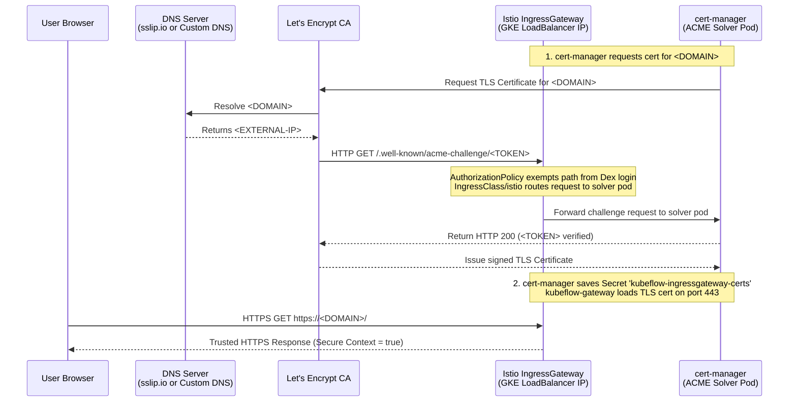

# Deploying Kubeflow Workspaces & Trainer on GKE Standard

This guide walks you through deploying **Kubeflow Workspaces (Notebooks v2)** and **Kubeflow Trainer (v2)** on Google Kubernetes Engine (GKE) **Standard clusters** directly using the official, unmodified manifests from [`kubeflow-community-distribution`](https://github.com/kubeflow/community-distribution) **without creating custom overlays, patch files, or modifying code in git**.

Unlike GKE Autopilot (which enforces strict security policies via GKE Warden), **GKE Standard** supports full cluster administrative capabilities, hostPath mounts for CNI (`/home/kubernetes/bin`), and custom daemonsets in `kube-system`. Therefore, Istio CNI, sidecar injection, and mTLS work out of the box without the complicated workarounds or patches required on Autopilot.

It configures static logins (Dex + OAuth2-Proxy) parameterized by shell environment variables (`USER_NAME`, `USER_PASSWORD`, and `USER_NAMESPACE`), and provides instructions for managing multi-user onboarding using standard `kubectl` workflows.

---

## 1. Prerequisites

### Cluster Creation
You can create a GKE Standard cluster with GKE UI or using gcloud commands.
```bash
export PROJECT_ID=""
export CLUSTER_NAME=""
export REGION=""  # the region where you have your TPU quota

gcloud container clusters create $CLUSTER_NAME \
  --addons=GcsFuseCsiDriver,GcpFilestoreCsiDriver `# Optional: Enable GCS and Filestore CSI drivers for persistent volumes` \
  --workload-pool=${PROJECT_ID}.svc.id.goog `# Enable Workload Identity for secure service-to-service communication` \
  --workload-metadata=GKE_METADATA `# Required for Workload Identity` \
  --num-nodes 1 `# Number of nodes in the cluster` \
  --machine-type e2-medium `# Machine type for the nodes` \
  --location=$REGION `# Location of the cluster` \
  --enable-image-streaming `# Enable image streaming` \
  --project=$PROJECT_ID


# create additional autoscaling node pool
gcloud container node-pools create e2-standard-4-pool \
    --cluster=$CLUSTER_NAME --project=$PROJECT_ID \
    --machine-type=e2-standard-4 \
    --location=$REGION \
    --enable-autoscaling \
    --min-nodes=0 \
    --max-nodes=1  `# 1 per zone`
```

### Cluster Connection
Ensure your shell is authenticated to your GKE Standard cluster:
```bash
gcloud container clusters get-credentials $CLUSTER_NAME --region $REGION --project $PROJECT_ID
kubectl cluster-info
```

### Tools Required
- `kubectl` (v1.28+)
- `kustomize` (v5.0+)
- `python3` with `bcrypt` (for generating password hashes)

### User & Namespace Configuration
Define two distinct users—a **Workspace Admin** (`ADMIN_NAME`, who can see and edit cluster-wide `WorkspaceKind` templates in the UI) and a **Standard User** (`USER_NAME`). In the **Workspaces** tab, both users only see workspaces within their own namespace; the only UI difference for `ADMIN_NAME` is access to the **Workspace kinds** tab to view and edit `WorkspaceKind` (`wsk`) templates:
```bash
# 1. Workspace Admin (can view and edit cluster-wide WorkspaceKind templates)
export ADMIN_NAME="admin@example.com"
export ADMIN_PASSWORD="admin1234"
export ADMIN_NAMESPACE="kubeflow-admin-example-com"

# 2. Standard User (scoped strictly to their own workspace namespace)
export USER_NAME="user@example.com"
export USER_PASSWORD="12341234"
export USER_NAMESPACE="kubeflow-user-example-com"

# 3. (Optional) Custom Domain & Pre-allocated Static IP for HTTPS
# If unset or empty, deploy_standard.sh automatically provisions a certificate using <EXTERNAL_IP>.sslip.io (free, zero DNS setup)
export CUSTOM_DOMAIN=""  # e.g., "kubeflow.example.com"
export STATIC_IP=""       # e.g., "34.53.68.77" (optional pre-allocated GCP regional static external IP)
```
*(You can customize these emails, passwords, and namespace names; all subsequent steps reference these environment variables.)*

### GKE StorageClass Configuration
Kubeflow Workspaces requires the StorageClass to be labeled with `notebooks.kubeflow.org/can-use=true` so it appears in the Workspaces UI and can dynamically provision persistent disks:
```bash
kubectl label storageclass standard-rwo "notebooks.kubeflow.org/can-use=true" --overwrite=true
kubectl annotate storageclass standard-rwo \
  "notebooks.kubeflow.org/display-name=Standard RWO (Persistent Disk)" \
  "notebooks.kubeflow.org/description=Compute Engine persistent disk storage on GKE." \
  --overwrite=true
```

---

## 2. Step-by-Step Deployment (Pure Upstream Manifests)

All commands are executed from the root of [`kubeflow-community-distribution`](https://github.com/kubeflow/community-distribution):
```bash
git clone https://github.com/kubeflow/community-distribution.git

cd community-distribution
```

### Step 1: Deploy Cert-Manager
Cert-Manager generates TLS certificates for the admission webhooks used by Workspaces, Trainer, and Central Dashboard. On GKE Standard, cert-manager uses standard leader election leases in `kube-system` without needing any custom RBAC roles or deployment patches:
```bash
# 1. Apply cert-manager manifests
kubectl apply -k common/cert-manager/base
kubectl apply -k common/cert-manager/overlays/kubeflow

# 2. Wait for cert-manager components to be ready
kubectl -n cert-manager rollout status deployment/cert-manager-webhook --timeout=180s
kubectl -n cert-manager rollout status deployment/cert-manager-cainjector --timeout=180s
kubectl -n cert-manager rollout status deployment/cert-manager --timeout=180s
```

---

### Step 2: Deploy Core Istio Infrastructure & CNI for GKE
Deploy Istio CRDs, namespaces, ingress gateways, Kubeflow RBAC roles, and Istio CNI configured for GKE:
```bash
# 1. Namespaces and Istio CRDs
# (Deploying `common/kubeflow-namespace/base` here ensures `kubeflow` and `kubeflow-system`
# namespaces exist before Istio applies sidecar prune rules into namespace `kubeflow`)
kubectl apply -k common/istio/istio-crds/base
kubectl apply -k common/istio/istio-namespace/base
kubectl apply -k common/kubeflow-namespace/base

# 2. Deploy Istio with GKE CNI overlay
# The GKE overlay configures the Istio CNI DaemonSet to use GKE's writable CNI hostPath at /home/kubernetes/bin.
# On GKE Standard, this DaemonSet runs natively in `kube-system`.
kubectl apply -k common/istio/istio-install/overlays/gke --server-side --force-conflicts

# 3. Wait for Istio sidecar injector webhook and CNI daemonset to be ready
kubectl rollout status deployment/istiod -n istio-system --timeout=180s
kubectl rollout status daemonset/istio-cni-node -n kube-system --timeout=180s

# 4. Kubeflow Core Roles and Istio Mesh Configuration
kubectl apply -k common/kubeflow-roles/base
kubectl apply -k common/istio/kubeflow-istio-resources/base
```

> [!NOTE]
> Because Istio CNI installs and runs cleanly via DaemonSet on GKE Standard, sidecar injection (`istio-injection: enabled`) and mutual TLS (mTLS) work out of the box. There is no need to disable sidecar injection or strip namespace labels.

---

### Step 3: Deploy Authentication (Dex & OAuth2-Proxy)
Deploy Dex (OIDC provider) and OAuth2-Proxy, configuring Dex with both the **Admin User** (`$ADMIN_NAME`) and the **Standard User** (`$USER_NAME`):

```bash
# 1. Deploy base Dex and OAuth2-Proxy manifests
kubectl apply -k common/dex/overlays/oauth2-proxy
kubectl apply -k common/oauth2-proxy/overlays/m2m-dex-only

# 2. Generate bcrypt hashes for $ADMIN_PASSWORD and $USER_PASSWORD
ADMIN_HASH=$(python3 -c 'import bcrypt, os; print(bcrypt.hashpw(os.environ["ADMIN_PASSWORD"].encode(), bcrypt.gensalt(12)).decode())')
USER_HASH=$(python3 -c 'import bcrypt, os; print(bcrypt.hashpw(os.environ["USER_PASSWORD"].encode(), bcrypt.gensalt(12)).decode())')

# 3. Update the dex-passwords Secret in namespace auth with both hashes
kubectl create secret generic dex-passwords -n auth \
  --from-literal=DEX_ADMIN_PASSWORD="${ADMIN_HASH}" \
  --from-literal=DEX_USER_PASSWORD="${USER_HASH}" \
  --dry-run=client -o yaml | kubectl apply -f -

# 4. Configure Dex ConfigMap with both $ADMIN_NAME and $USER_NAME
kubectl apply -f - <<EOF
apiVersion: v1
kind: ConfigMap
metadata:
  name: dex
  namespace: auth
data:
  config.yaml: |
    issuer: http://dex.auth.svc.cluster.local:5556/dex
    storage:
      type: kubernetes
      config:
        inCluster: true
    web:
      http: 0.0.0.0:5556
    logger:
      level: "debug"
      format: text
    oauth2:
      skipApprovalScreen: true
    enablePasswordDB: true
    staticPasswords:
    - email: ${ADMIN_NAME}
      hashFromEnv: DEX_ADMIN_PASSWORD
      username: ${ADMIN_NAME%%@*}
      userID: "10000000000001"
    - email: ${USER_NAME}
      hashFromEnv: DEX_USER_PASSWORD
      username: ${USER_NAME%%@*}
      userID: "15841185641784"
    staticClients:
    - idEnv: OIDC_CLIENT_ID
      redirectURIs: ["/oauth2/callback"]
      name: 'Dex Login Application'
      secretEnv: OIDC_CLIENT_SECRET
EOF

# 5. Restart Dex to pick up the credentials
kubectl rollout restart deployment/dex -n auth
```

---

### Step 4: Deploy Kubeflow Central Dashboard
Deploy the Central Dashboard UI:
```bash
kubectl apply -k applications/dashboard/overlays/istio
```
*(On GKE Standard, the dashboard and profile controller pods start cleanly with injected Istio sidecars without any patching.)*

---

### Step 5: Deploy Kubeflow Workspaces (Notebooks v2)
Deploy the Workspaces controller, backend, and frontend:
```bash
kubectl apply -k applications/workspaces/overlays/istio

# Add the Kubeflow Workspaces tab to the Central Dashboard
kubectl apply --namespace kubeflow --filename "https://raw.githubusercontent.com/kubeflow/community-distribution/26.03.1/applications/workspaces/components/centraldashboard/centraldashboard-config.yaml"
```
*(All components run securely with default Istio sidecars and mTLS enabled.)*

---

### Step 6: Deploy Kubeflow Trainer (v2)
Deploy the Kubeflow Trainer controller manager, JobSet controller manager, and cluster training runtimes:
```bash
# Note: `--server-side --force-conflicts` is used because Trainer and JobSet CRDs exceed
# the 256KB client-side apply annotation limit.
# The first apply installs the CRDs; wait for CRDs to establish before re-applying ClusterTrainingRuntimes.
kubectl apply -k applications/trainer/overlays --server-side --force-conflicts || true
kubectl wait --for=condition=Established crd/clustertrainingruntimes.trainer.kubeflow.org --timeout=60s
kubectl apply -k applications/trainer/overlays --server-side --force-conflicts
```
*(On GKE Standard, the upstream RBAC bindings to `system:authenticated` succeed without restriction.)*

---

### Step 7: Deploy Profiles for Admin & Standard User
Create a `Profile` resource for both `${ADMIN_NAME}` (`${ADMIN_NAMESPACE}`) and `${USER_NAME}` (`${USER_NAMESPACE}`).
The Profile controller automatically provisions each namespace, binds the `default-editor` ServiceAccount, configures `kubeflow-edit` permissions for Workspaces and Trainer within that namespace, and creates an Istio `AuthorizationPolicy` isolating traffic to that user:

```bash
kubectl apply -f - <<EOF
apiVersion: kubeflow.org/v1beta1
kind: Profile
metadata:
  name: ${ADMIN_NAMESPACE}
spec:
  owner:
    kind: User
    name: ${ADMIN_NAME}
---
apiVersion: kubeflow.org/v1beta1
kind: Profile
metadata:
  name: ${USER_NAMESPACE}
spec:
  owner:
    kind: User
    name: ${USER_NAME}
EOF
```

---

### Step 8: Register Default WorkspaceKind & Grant Admin Cluster Access

1. **Register the JupyterLab WorkspaceKind**:
```bash
kubectl apply -f applications/workspaces/upstream/controller/samples/jupyterlab_v1beta1_workspacekind.yaml
```
> [!NOTE]
> `WorkspaceKind` is a **cluster-scoped** resource (like `ClusterTrainingRuntime`), not a namespaced resource. Applying it with `-n <namespace>` will apply it cluster-wide.

> [!IMPORTANT]
> **Remove Sample `filterRules`**: The upstream sample file contains an example filter rule (`scope: WORKSPACE_KIND`) that restricts JupyterLab visibility only to namespaces labeled with `workspace_team=team_1`. To make it accessible across all user namespaces, remove the sample filter rule:
> ```bash
> kubectl patch wsk jupyterlab --type='json' -p='[{"op": "remove", "path": "/spec/filterRules"}]'
> ```

2. **Grant Admin User (`$ADMIN_NAME`) Cluster Access to WorkspaceKind Templates**:
How permissions differ between the two users:
- **Standard User (`$USER_NAME`)**: Needs **no `ClusterRoleBinding` at all**. When `$USER_NAME` clicks **New Workspace**, the backend calls `GET /api/v1/workspacekinds?namespaceFilter=${USER_NAMESPACE}`, which only checks namespaced `create` permission on `workspaces` (automatically granted by their `Profile`). They can create, use, and connect to workspaces in their own namespace, but cannot access the **Workspace kinds** tab.
- **Admin User (`$ADMIN_NAME`)**: Just like the standard user, `$ADMIN_NAME` only sees their own namespace (`$ADMIN_NAMESPACE`) in the **Workspaces** tab. The **only thing `$ADMIN_NAME` can do differently in the UI** is access the **Workspace kinds** tab to view and edit cluster-wide `WorkspaceKind` (`wsk`) templates.

Apply the `kubeflow-admin` and cluster storage/runtime bindings for `${ADMIN_NAME}`:
```bash
kubectl apply -f - <<EOF
apiVersion: rbac.authorization.k8s.io/v1
kind: ClusterRole
metadata:
  name: kubeflow-workspaces-cluster-admin
rules:
- apiGroups: [""]
  resources: ["namespaces"]
  verbs: ["get", "list", "watch"]
- apiGroups: ["storage.k8s.io"]
  resources: ["storageclasses"]
  verbs: ["get", "list", "watch"]
- apiGroups: ["kubeflow.org"]
  resources: ["workspacekinds", "workspacekinds/status", "workspaces", "workspaces/status"]
  verbs: ["get", "list", "watch", "create", "update", "patch", "delete"]
- apiGroups: ["trainer.kubeflow.org"]
  resources: ["clustertrainingruntimes"]
  verbs: ["get", "list", "watch"]
---
apiVersion: rbac.authorization.k8s.io/v1
kind: ClusterRoleBinding
metadata:
  name: kubeflow-workspaces-cluster-admin-${ADMIN_NAME%%@*}
roleRef:
  apiGroup: rbac.authorization.k8s.io
  kind: ClusterRole
  name: kubeflow-workspaces-cluster-admin
subjects:
- kind: User
  name: ${ADMIN_NAME}
  apiGroup: rbac.authorization.k8s.io
---
apiVersion: rbac.authorization.k8s.io/v1
kind: ClusterRoleBinding
metadata:
  name: kubeflow-admin-${ADMIN_NAME%%@*}
roleRef:
  apiGroup: rbac.authorization.k8s.io
  kind: ClusterRole
  name: kubeflow-admin
subjects:
- kind: User
  name: ${ADMIN_NAME}
  apiGroup: rbac.authorization.k8s.io
EOF
```

---

### Step 9: Verify All Rollouts
Confirm that all core controllers, services, and CNI daemonsets are healthy:
```bash
# Networking & CNI
kubectl rollout status deployment/istiod -n istio-system --timeout=180s
kubectl rollout status daemonset/istio-cni-node -n kube-system --timeout=180s

# Auth
kubectl rollout status deployment/dex -n auth --timeout=180s
kubectl rollout status deployment/oauth2-proxy -n oauth2-proxy --timeout=180s

# Dashboard & Profile Controller
kubectl rollout status deployment/dashboard -n kubeflow --timeout=180s
kubectl rollout status deployment/profiles-deployment -n kubeflow --timeout=180s

# Workspaces (Notebooks v2)
kubectl rollout status deployment/workspaces-controller -n kubeflow-workspaces --timeout=180s
kubectl rollout status deployment/workspaces-backend -n kubeflow-workspaces --timeout=180s
kubectl rollout status deployment/workspaces-frontend -n kubeflow-workspaces --timeout=180s

# Kubeflow Trainer (v2)
kubectl rollout status deployment/kubeflow-trainer-controller-manager -n kubeflow-system --timeout=180s
kubectl rollout status deployment/jobset-controller-manager -n kubeflow-system --timeout=180s

# User Namespace ServiceAccounts
kubectl get serviceaccount default-editor -n ${ADMIN_NAMESPACE}
kubectl get serviceaccount default-editor -n ${USER_NAMESPACE}
```

---

## 3. Adding Additional Standard Users (Multi-User Setup)

Because standard users only need namespaced permissions in their own `Profile` namespace to create and use workspaces, onboarding a new regular user (e.g. `alice@example.com`) requires **only** adding her credentials to Dex and applying her `Profile` (no `ClusterRoleBinding` is needed):

1. **Generate a bcrypt hash for the new user**:
   ```bash
   ALICE_HASH=$(python3 -c 'import bcrypt; print(bcrypt.hashpw(b"<ALICE_PASSWORD>", bcrypt.gensalt(12)).decode())')
   echo "${ALICE_HASH}"
   ```

2. **Append the new user to `ConfigMap/dex`**:
   ```bash
   kubectl edit configmap dex -n auth
   ```
   Under `staticPasswords`, append the new user:
   ```yaml
   staticPasswords:
   - email: ${ADMIN_NAME}
     hashFromEnv: DEX_ADMIN_PASSWORD
     username: ${ADMIN_NAME%%@*}
     userID: "10000000000001"
   - email: ${USER_NAME}
     hashFromEnv: DEX_USER_PASSWORD
     username: ${USER_NAME%%@*}
     userID: "15841185641784"
   - email: alice@example.com
     hash: "<PASTE_ALICE_BCRYPT_HASH>"
     username: alice
     userID: "28492048201948"  # Any unique numeric or UUID string
   ```
   Restart Dex:
   ```bash
   kubectl rollout restart deployment/dex -n auth
   ```

3. **Provision Alice's Isolated Namespace**:
   Apply a `Profile` for Alice:
   ```bash
   kubectl apply -f - <<EOF
   apiVersion: kubeflow.org/v1beta1
   kind: Profile
   metadata:
     name: kubeflow-user-alice-example-com
   spec:
     owner:
       kind: User
       name: alice@example.com
   EOF
   ```
   The Profile controller automatically creates:
   - Namespace `kubeflow-user-alice-example-com`
   - ServiceAccount `default-editor`
   - RoleBindings granting `kubeflow-edit` (access to Workspaces and Trainer in her namespace)
   - Istio `AuthorizationPolicy` isolating traffic to Alice's authenticated session.

*(Alice can immediately log in, select `kubeflow-user-alice-example-com`, click **New Workspace**, and create/connect to notebooks in her own namespace without any cluster-level RBAC bindings.)*

---

## 4. Exposing & Accessing the Central Dashboard (Secure Context for VS Code / code-server)

> [!IMPORTANT]
> **Why VS Code (`code-server`) and Coding Agents Require HTTPS or `localhost`**:
> Modern web browsers enforce the W3C **Secure Context** specification (`window.isSecureContext`). Plain HTTP on a non-local IP address (`http://<EXTERNAL-IP>/`) is treated as an **insecure context**, which disables:
> - **Service Workers (`navigator.serviceWorker`)**: Required by VS Code Webviews (`vscode-webview://`) to render **Gemini Code Assist**, coding agents, and the Jupyter extension.
> - **Clipboard API (`navigator.clipboard`)**: Copy/paste shortcuts and agent clipboard actions fail.
> - **WebCrypto API (`window.crypto.subtle`)**: Used for extension state signing.
>
> To avoid the warning `"code-server is being accessed in an insecure context..."` and ensure coding agents work properly, use **Option A (`http://localhost:8085/`)** or **Option B1 (`https://<DOMAIN>/`)**.

---

### Option A: Local Port-Forwarding (`http://localhost:8085/`)
Browsers natively treat `http://localhost:*` as a **Secure Context** (`window.isSecureContext === true`) even over plain HTTP. Port-forward the Ingress Gateway to your local machine:
```bash
kubectl port-forward svc/istio-ingressgateway -n istio-system 8085:80
```
Navigate in your browser to:
```
http://localhost:8085/
```
*(All VS Code Webviews, clipboard operations, and coding agents work out-of-the-box).*

---

### Option B1: Public GKE LoadBalancer with Trusted Let's Encrypt HTTPS

`deploy_standard.sh` automatically provisions a **free, publicly trusted Let's Encrypt HTTPS certificate** for your GKE LoadBalancer using either:
- **Case 1: No Custom Domain (Default / Quickstart)** — Automatically uses `<EXTERNAL-IP>.sslip.io` (zero DNS setup required).
- **Case 2: Custom Domain (e.g., `kubeflow.example.com`)** — Uses your registered domain name after configuring a DNS A record.

---

#### What To Do If You Have Your Own Custom Domain

Because a DNS A record must point to an IPv4 address, you have two workflows depending on whether you let GKE dynamically assign an external IP or pre-allocate a static IP:

##### Approach 1: Dynamic IP (Deploy First -> Add DNS -> Rerun or In-Script Wait)
This is the standard approach when you don't have a pre-allocated IP address:
1. **Get the LoadBalancer IP**:
   Run `deploy_standard.sh` without setting `CUSTOM_DOMAIN` (or run through Step 2). GKE allocates an ephemeral external IP and provides an immediate working `sslip.io` HTTPS domain:
   ```bash
   EXTERNAL_IP=$(kubectl get svc istio-ingressgateway -n istio-system -o jsonpath='{.status.loadBalancer.ingress[0].ip}')
   echo "LoadBalancer External IP: ${EXTERNAL_IP}"
   ```
2. **Add an A Record in Your DNS Provider**:
   In your domain registrar / DNS provider (Cloud DNS, Route 53, Cloudflare, GoDaddy, etc.):
   - **Type**: `A`
   - **Host / Name**: Subdomain (e.g. `kubeflow` for `kubeflow.example.com`) or `@` (for root apex `example.com`)
   - **Value / Destination**: `<EXTERNAL-IP>` (e.g., `34.53.68.77`)
   - **TTL**: `300` seconds (or lowest supported for quick propagation)

   > [!TIP]
   > **Cloudflare Users**: Ensure proxy status is set to **"DNS only"** (grey cloud), not "Proxied" (orange cloud), so Let's Encrypt's ACME HTTP-01 challenge can reach your cluster directly.

3. **Verify DNS Propagation & Switch Certificate**:
   ```bash
   dig +short kubeflow.example.com
   ```
   Once it resolves to `${EXTERNAL_IP}`, switch the certificate by rerunning `deploy_standard.sh`:
   ```bash
   export CUSTOM_DOMAIN="kubeflow.example.com"
   ./deploy_standard.sh
   ```
   *(Because `deploy_standard.sh` is completely idempotent, this re-run takes only ~15 seconds to issue the new Let's Encrypt certificate and update the Gateway).*

   > [!NOTE]
   > **In-Script Wait**: If you run with `export CUSTOM_DOMAIN="kubeflow.example.com"` on the very first run, `deploy_standard.sh` will display the provisioned LoadBalancer IP and automatically pause/poll for up to 120 seconds for you to create the DNS A record, proceeding without needing a rerun as soon as DNS resolves.

---

##### Approach 2: Pre-allocated GCP Static IP (Single Pass, No Rerun)
If you want to configure DNS *before* deploying:
1. **Reserve a Static External IP in GCP**:
   ```bash
   gcloud compute addresses create kubeflow-ip --region=$REGION --project=$PROJECT_ID
   STATIC_IP=$(gcloud compute addresses describe kubeflow-ip --region=$REGION --project=$PROJECT_ID --format='value(address)')
   echo "Reserved Static IP: ${STATIC_IP}"
   ```
2. **Add the DNS A Record Ahead of Time**:
   Create the A record in your DNS provider pointing your domain (e.g., `kubeflow.example.com`) to `${STATIC_IP}`.
3. **Deploy in a Single Pass**:
   ```bash
   export STATIC_IP="${STATIC_IP}"
   export CUSTOM_DOMAIN="kubeflow.example.com"
   ./deploy_standard.sh
   ```
   `deploy_standard.sh` binds `istio-ingressgateway` to that static IP, DNS is already live, and the Let's Encrypt certificate is issued immediately on the first pass.

---

#### What To Do If You Do Not Have a Domain (Default: `sslip.io`)

If you don't have a domain name or want an instant, zero-DNS setup, leave `CUSTOM_DOMAIN` unset:
```bash
EXTERNAL_IP=$(kubectl get svc istio-ingressgateway -n istio-system -o jsonpath='{.status.loadBalancer.ingress[0].ip}')
echo "https://${EXTERNAL_IP}.sslip.io/"
```
The script or manual commands will automatically use `<EXTERNAL-IP>.sslip.io`.

---

#### How `DOMAIN`, `IngressClass`, and `cert-manager` Work Together (Beginner's Guide)

If you are new to Kubernetes networking, DNS, and TLS certificates, here is how a browser-trusted HTTPS certificate is provisioned:



1. **Why a Domain Name is Required (`sslip.io` vs. Custom Domain)**:
   - Public Certificate Authorities like **Let's Encrypt** refuse to issue trusted certificates for bare IP addresses (e.g. `34.53.68.77`); they only issue certificates for valid **domain names**.
   - **If you do not have a domain**: **[sslip.io](https://sslip.io/)** is a free public "magic" DNS service where `<IP>.sslip.io` (e.g. `34.53.68.77.sslip.io`) automatically resolves to `34.53.68.77` with zero configuration.
   - **If you have a custom domain**: Your DNS provider resolves your custom hostname (e.g. `kubeflow.example.com`) to `34.53.68.77` via an A record.
   - Once DNS resolves to the LoadBalancer IP, the entire Kubernetes ACME workflow is **100% identical**!

2. **How Let's Encrypt Verifies Ownership (`ACME HTTP-01 Challenge`)**:
   - When `cert-manager` asks Let's Encrypt for a certificate for `${DOMAIN}`, Let's Encrypt must verify that you actually control the server pointed to by `${DOMAIN}`.
   - Let's Encrypt gives `cert-manager` a random token and makes an HTTP request from the public internet to:
     `http://${DOMAIN}/.well-known/acme-challenge/<TOKEN>`
   - To answer that request, `cert-manager` creates a temporary pod (`cm-acme-http-solver-*`) inside your cluster that serves the expected token.

3. **Why `IngressClass/istio` is Required**:
   - To route incoming traffic from the GKE LoadBalancer (`istio-ingressgateway`) to that temporary solver pod, `cert-manager` creates a standard Kubernetes `Ingress` resource marked with `ingressClassName: istio`.
   - Kubernetes ignores `ingressClassName: istio` unless an `IngressClass` object named `istio` (`controller: istio.io/ingress-controller`) is registered in the cluster.
   - Creating `IngressClass/istio` tells Istio's control plane (`istiod`) to watch `cert-manager`'s temporary `Ingress` rules and automatically route `/.well-known/acme-challenge/*` traffic through `istio-ingressgateway` to the solver pod.

4. **Why Istio `AuthorizationPolicy` Must Exempt `/.well-known/acme-challenge/*`**:
   - By default, Kubeflow secures every URL on `istio-ingressgateway` behind `oauth2-proxy` (`istio-ingressgateway-oauth2-proxy` and `istio-ingressgateway-require-jwt`).
   - If an unauthenticated visitor—including Let's Encrypt's verification bot—requests `/.well-known/acme-challenge/<TOKEN>`, Kubeflow blocks the request and returns a Dex login page (`403 Forbidden`). Let's Encrypt sees the login page instead of the token, and certificate issuance fails.
   - Adding `/.well-known/acme-challenge/*` to `notPaths` in both `AuthorizationPolicy` resources tells Istio: *"Allow unauthenticated access to `/.well-known/acme-challenge/*` so Let's Encrypt can verify domain ownership."*

5. **How `kubeflow-gateway` Serves HTTPS on Port 443**:
   - Once Let's Encrypt verifies the token (typically in ~15 seconds), `cert-manager` stores the signed TLS certificate and private key in a Kubernetes Secret named `kubeflow-ingressgateway-certs` in the `istio-system` namespace.
   - Finally, `kubeflow-gateway` is updated with an HTTPS listener on port `443` referencing `credentialName: kubeflow-ingressgateway-certs`. The Istio Ingress Gateway immediately begins serving browser-trusted HTTPS traffic.

#### Step-by-Step Commands (Automated by `deploy_standard.sh`)

If you want to inspect or apply the HTTPS configuration manually on an existing cluster:

```bash
EXTERNAL_IP=$(kubectl get svc istio-ingressgateway -n istio-system -o jsonpath='{.status.loadBalancer.ingress[0].ip}')

# Choose your domain:
# Case 1: Custom domain (ensure your DNS A record points to $EXTERNAL_IP first)
# DOMAIN="kubeflow.example.com"
# Case 2: Auto sslip.io domain (zero DNS setup)
DOMAIN="${CUSTOM_DOMAIN:-${EXTERNAL_IP}.sslip.io}"
echo "Configuring HTTPS for domain: ${DOMAIN}"

# 1. Register IngressClass 'istio' & exempt ACME challenge paths from OAuth2 login
kubectl apply -f - <<EOF
apiVersion: networking.k8s.io/v1
kind: IngressClass
metadata:
  name: istio
spec:
  controller: istio.io/ingress-controller
---
apiVersion: security.istio.io/v1
kind: AuthorizationPolicy
metadata:
  name: istio-ingressgateway-oauth2-proxy
  namespace: istio-system
spec:
  action: CUSTOM
  provider:
    name: oauth2-proxy
  rules:
  - to:
    - operation:
        notPaths:
        - /dex/*
        - /dex/**
        - /oauth2/*
        - /.well-known/acme-challenge/*
    when:
    - key: request.headers[authorization]
      notValues:
      - '*'
  selector:
    matchLabels:
      app: istio-ingressgateway
---
apiVersion: security.istio.io/v1
kind: AuthorizationPolicy
metadata:
  name: istio-ingressgateway-require-jwt
  namespace: istio-system
spec:
  action: DENY
  rules:
  - from:
    - source:
        notRequestPrincipals:
        - '*'
    to:
    - operation:
        notPaths:
        - /dex/*
        - /dex/**
        - /oauth2/*
        - /.well-known/acme-challenge/*
  selector:
    matchLabels:
      app: istio-ingressgateway
EOF

# 2. Create Let's Encrypt ClusterIssuer & Certificate for ${DOMAIN}
kubectl apply -f - <<EOF
apiVersion: cert-manager.io/v1
kind: ClusterIssuer
metadata:
  name: letsencrypt-prod
spec:
  acme:
    server: https://acme-v02.api.letsencrypt.org/directory
    privateKeySecretRef:
      name: letsencrypt-prod-account-key
    solvers:
    - http01:
        ingress:
          ingressClassName: istio
---
apiVersion: cert-manager.io/v1
kind: Certificate
metadata:
  name: kubeflow-ingressgateway-certs
  namespace: istio-system
spec:
  secretName: kubeflow-ingressgateway-certs
  issuerRef:
    name: letsencrypt-prod
    kind: ClusterIssuer
  dnsNames:
  - ${DOMAIN}
EOF

# 3. Wait for Let's Encrypt certificate to become Ready (~15-30 seconds)
kubectl wait --for=condition=Ready certificate/kubeflow-ingressgateway-certs -n istio-system --timeout=90s

# 4. Enable HTTPS (port 443) on kubeflow-gateway
kubectl apply -f - <<EOF
apiVersion: networking.istio.io/v1
kind: Gateway
metadata:
  name: kubeflow-gateway
  namespace: kubeflow
spec:
  selector:
    istio: ingressgateway
  servers:
  - hosts:
    - '*'
    port:
      name: http
      number: 80
      protocol: HTTP
  - hosts:
    - '*'
    port:
      name: https
      number: 443
      protocol: HTTPS
    tls:
      mode: SIMPLE
      credentialName: kubeflow-ingressgateway-certs
EOF
```

---

### Option B2: Chrome Flag for Plain HTTP IP (`http://<EXTERNAL-IP>/`)
If you must access via raw IP over HTTP (`http://<EXTERNAL-IP>/`), you can instruct Chrome/Edge to treat the IP as a Secure Context:
1. Open `chrome://flags/#unsafely-treat-insecure-origin-as-secure` in your browser.
2. Add your LoadBalancer origin: `http://<EXTERNAL-IP>`
3. Enable the flag and click **Relaunch**.

---

## 5. Using & Verifying Workspaces (Notebooks v2)

1. Open the Kubeflow Central Dashboard in your browser and sign in via Dex using `$USER_NAME` and `$USER_PASSWORD`.
2. Select your user namespace (`$USER_NAMESPACE`) from the namespace selector dropdown in the top bar.
3. In the left navigation, click **Notebooks v2 -> Workspaces** (or visit `http://<INGRESS_URL>/workspaces/`).
4. Click **New Workspace**:
   - Select **JupyterLab Notebook**
   - Select desired hardware specs and confirm StorageClass is `standard-rwo`
   - Click **Create Workspace**
5. Once the state transitions to `Running`, click **Connect** to open JupyterLab.

Alternatively, spawn a workspace directly via `kubectl`:
```bash
kubectl apply -f - <<EOF
apiVersion: v1
kind: PersistentVolumeClaim
metadata:
  name: workspace-pvc
  namespace: ${USER_NAMESPACE}
spec:
  accessModes:
    - ReadWriteOnce
  storageClassName: standard-rwo
  resources:
    requests:
      storage: 10Gi
---
apiVersion: kubeflow.org/v1beta1
kind: Workspace
metadata:
  name: test-workspace
  namespace: ${USER_NAMESPACE}
spec:
  paused: false
  kind: "jupyterlab"
  podTemplate:
    volumes:
      home: "workspace-pvc"
    options:
      imageConfig: "jupyter-scipy:v1.10.0"
      podConfig: "tiny_cpu"
EOF
```

Access the notebook directly via:
```
http://<INGRESS_URL>/workspace/connect/${USER_NAMESPACE}/test-workspace/jupyterlab/
```

---

## 6. Using & Verifying Kubeflow Trainer (v2)

### Check Available Runtimes
Verify the default cluster training runtimes are available:
```bash
kubectl get clustertrainingruntime
```
*Output includes `torch-distributed`, `deepspeed-distributed`, `jax-distributed`, `torchtune`, etc.*

### Submit a TrainJob
Run a PyTorch training job in your user namespace:
```bash
kubectl apply -f - <<EOF
apiVersion: trainer.kubeflow.org/v1alpha1
kind: TrainJob
metadata:
  name: torch-demo-job
  namespace: ${USER_NAMESPACE}
spec:
  runtimeRef:
    name: torch-distributed
  trainer:
    image: pytorch/pytorch:2.4.0-cuda12.1-cudnn9-runtime
    command:
      - python3
      - -c
      - |
        import torch
        print("=" * 50)
        print("🚀 Kubeflow Trainer Job Executing on GKE Standard!")
        print(f"PyTorch Version: {torch.__version__}")
        print(f"CUDA Available:  {torch.cuda.is_available()}")
        print("✅ Training step completed successfully.")
        print("=" * 50)
EOF
```

### Inspect the Job & Logs
```bash
kubectl get trainjob -n ${USER_NAMESPACE}
kubectl logs -n ${USER_NAMESPACE} -l trainer.kubeflow.org/trainjob-ancestor-step=trainer -c node
```

---

## 7. Teardown & Cleanup

To cleanly remove all deployed components:
```bash
cd kubeflow-community-distribution

# 1. Delete user workloads and profiles
kubectl delete workspaces --all -n ${ADMIN_NAMESPACE} --ignore-not-found
kubectl delete workspaces --all -n ${USER_NAMESPACE} --ignore-not-found
kubectl delete trainjobs --all -n ${ADMIN_NAMESPACE} --ignore-not-found
kubectl delete trainjobs --all -n ${USER_NAMESPACE} --ignore-not-found
kubectl delete profile ${ADMIN_NAMESPACE} ${USER_NAMESPACE} --ignore-not-found
kubectl delete clusterrolebinding kubeflow-workspaces-cluster-admin-${ADMIN_NAME%%@*} kubeflow-admin-${ADMIN_NAME%%@*} --ignore-not-found
kubectl delete clusterrole kubeflow-workspaces-cluster-admin --ignore-not-found
kubectl delete workspacekinds --all --ignore-not-found

# 2. Delete components in reverse order
kubectl delete -k applications/trainer/overlays --ignore-not-found
kubectl delete -k applications/workspaces/overlays/istio --ignore-not-found
kubectl delete -k applications/dashboard/overlays/istio --ignore-not-found
kubectl delete -k common/oauth2-proxy/overlays/m2m-dex-only --ignore-not-found
kubectl delete -k common/dex/overlays/oauth2-proxy --ignore-not-found
kubectl delete -k common/istio/kubeflow-istio-resources/base --ignore-not-found
kubectl delete -k common/kubeflow-roles/base --ignore-not-found
kubectl delete -k common/kubeflow-namespace/base --ignore-not-found
kubectl delete -k common/istio/istio-install/overlays/gke --ignore-not-found
kubectl delete -k common/istio/istio-namespace/base --ignore-not-found
kubectl delete -k common/istio/istio-crds/base --ignore-not-found
kubectl delete -k common/cert-manager/overlays/kubeflow --ignore-not-found
kubectl delete -k common/cert-manager/base --ignore-not-found

# 3. Clean up system namespaces if needed
kubectl delete namespace kubeflow-workspaces kubeflow-system kubeflow oauth2-proxy auth istio-system --ignore-not-found
```
