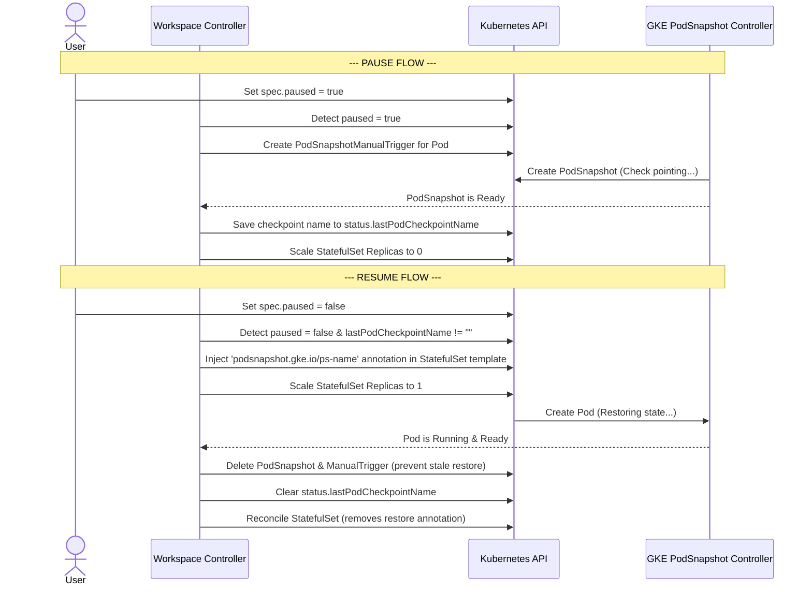

# Design Doc: GKE PodSnapshot Integration for Stateful Workspace Pause/Resume

This document describes the design and implementation of the Proof of Concept (POC) for statefully pausing and resuming Kubeflow Workspaces on Google Kubernetes Engine (GKE) using the GKE PodSnapshot API.

---

## 1. Objective

Allow users to **Pause** a running workspace (saving its full CPU/Memory execution state to a GCS bucket) and **Resume** it later. When resumed, the workspace should restore all running applications, open terminals, and unsaved work without losing any state.

---

## 2. GKE PodSnapshot API Overview

GKE PodSnapshot uses gVisor sandboxing (`runtimeClassName: gvisor`) to snapshot the memory state of a container. It relies on four Custom Resource Definitions (CRDs):

1.  **`PodSnapshotStorageConfig`**: Cluster or namespace-scoped config defining the GCS bucket and path prefix where the checkpoint files are stored.
2.  **`PodSnapshotPolicy`**: Namespace-scoped resource pointing to the storage config, defining selector labels to match target pods, and setting up trigger types (in our case, `manual`).
3.  **`PodSnapshotManualTrigger`**: Trigger created to execute a checkpoint for a specific pod.
4.  **`PodSnapshot`**: Automatically generated resource by the GKE controller containing status conditions (such as `Ready` status) and the GCS path of the checkpoint.

To restore a pod from a snapshot, GKE looks for the annotation `podsnapshot.gke.io/ps-name` on the Pod template spec during creation.

---

## 3. Architecture & Lifecycle Flow

We integrated PodSnapshot directly into the Kubeflow `WorkspaceReconciler`.



### 3.1. Pause Flow (Checkpointing)
1.  **Trigger**: User sets `spec.paused: true` on the `Workspace` resource.
2.  **Reconciler Intervention**:
    *   Verifies that the `WorkspaceKind` has PodCheckpoint enabled (`spec.podTemplate.podCheckpoint.enabled: true`).
    *   Reconciles a namespace-scoped `PodSnapshotPolicy` matching the workspace labels (if GKE provider is used).
    *   Creates a `PodSnapshotManualTrigger` targeting the active workspace pod name (if GKE provider is used).
3.  **Wait for Ready**: The reconciler polls/requeues until the GKE-generated `PodSnapshot` has condition `Ready: True` (if GKE provider is used).
4.  **Scaling Down**:
    *   The checkpoint name is saved to `workspace.Status.LastPodCheckpointName`.
    *   The desired replica count for the StatefulSet is set to `0`. The pod is terminated.

### 3.2. Resume Flow (Restoration)
1.  **Trigger**: User sets `spec.paused: false`.
2.  **Restore Spec Generation**:
    *   The reconciler notices `workspace.Status.LastPodCheckpointName` is populated.
    *   If GKE provider is used, it injects the annotation `podsnapshot.gke.io/ps-name: <checkpoint-name>` into the StatefulSet's pod template spec.
    *   The desired replica count is restored to `1`.
3.  **Pod Recreation**: The StatefulSet controller recreates the pod. If GKE provider is used, because of the annotation, the GKE runtime intercepts creation and streams the container state back from GCS.
4.  **Post-Restore Cleanup**:
    *   The reconciler waits until the pod is back in `Running` and `Ready` states.
    *   If GKE provider is used, it deletes the GKE `PodSnapshot` and `PodSnapshotManualTrigger` CRs.
    *   It clears `workspace.Status.LastPodCheckpointName = ""`.
    *   Removing `LastPodCheckpointName` means the next reconciliation loop generates a desired StatefulSet template **without** the GKE restore annotation, preventing infinite restore loops if the pod crashes/restarts.

---

## 4. Key Design Challenges & Solutions

### Challenge 1: The Infinite Reconciliation Loop & Pod Restart Race
When the workspace resumes, the controller injects the restore annotation. After the pod is running, the controller removes the annotation to prevent stale restorations.
*   **The Problem**: In a standard StatefulSet with `RollingUpdate` strategy, removing the annotation from the StatefulSet template constitutes a spec change. The native StatefulSet controller would immediately delete the restored pod and roll out a new one without the annotation (causing a second restart and losing the restored state!).
*   **Solution**:
    1.  **Change Update Strategy**: We permanently configured the StatefulSet `spec.updateStrategy.type` to `OnDelete`. This prevents the native controller from rolling out template changes automatically.
    2.  **Granular Template Comparison (`helper.TemplatesDiffer`)**:
        We implemented a custom template comparison utility. Standard `reflect.DeepEqual` fails because Kubernetes injects default values (e.g. `dnsPolicy: ClusterFirst`, `terminationGracePeriodSeconds: 30`) that are not present in our desired spec.
        Our custom helper compares only relevant fields (Containers, Volumes, SecurityContexts, etc.) and explicitly ignores:
        *   The transient GKE restore annotation: `podsnapshot.gke.io/ps-name`.
        *   Standard Kubernetes-injected default specs.
        *   If `TemplatesDiffer(desired, existing, ignoreRestore=true)` returns false, our controller knows there is no functional configuration drift and does not touch the pod.

### Challenge 2: Rolling Out Real Configuration Updates
Because we shifted to `OnDelete`, native Kubernetes rolling updates are disabled. If a user actually changes their workspace image or CPU limits, the pod would run forever with the old configuration.
*   **Solution**:
    We implemented a **Manual Pod Restart** loop in the reconciler:
    *   If the workspace is active (`paused: false`) and the pod is running.
    *   The reconciler evaluates `TemplatesDiffer(desiredTemplate, existingTemplate, ignoreRestore=true)`.
    *   If they differ, it means the user modified the workspace configuration (e.g., changed the container image).
    *   The reconciler prints `Deleting pod to trigger recreation with new configuration` and deletes the active pod.
    *   The StatefulSet controller then recreates the pod, which automatically picks up the updated template.

### Challenge 3: Jupyter Kernel Socket Loss (TCP Loopback vs. IPC)
*   **The Problem**: By default, Jupyter server communicates with the underlying execution kernel using TCP loopback sockets on port `127.0.0.1`. When GKE checkpoint/restores the pod, these TCP sockets are broken, causing the Jupyter server to lose connectivity to the active kernel process (resulting in a disconnected kernel and loss of variables/in-memory state on the frontend).
*   **Solution**:
    We modified the Jupyter server configuration to use Unix Domain Sockets (IPC) instead of TCP loopback by injecting the setting:
    ```python
    c.KernelManager.transport = 'ipc'
    ```
    Since unix domain socket files are created inside `/tmp/jupyter_runtime` (which is stored in the filesystem checkpoint and successfully restored by GKE), the socket descriptors remain valid across the snapshot/restore cycle. The notebook session seamlessly reconnects to the running kernel process, preserving all variables (e.g. `a=2`).

### Challenge 4: ConfigMap Defaults in Volume Comparison Loop
*   **The Problem**: To inject the IPC configuration without modifying base docker images, we mounted a Kubernetes `ConfigMap` (`jupyter-ipc-config`) to the pod. However, the Kubernetes API server automatically defaults the `defaultMode` field to `420` (octal 0644) on mounted ConfigMaps and Secrets in the active pod spec. Since the desired pod template in the controller did not specify `defaultMode`, `helper.TemplatesDiffer` detected a drift, triggering an infinite loop of pod recreation and deletion.
*   **Solution**:
    We implemented a custom volume comparison helper function `volumesDiffer` in `workspaces/controller/internal/helper/helper.go`. Instead of using `equality.Semantic.DeepEqual` on the raw volume specs, the helper performs granular comparison of fields that are explicitly defined in the desired template (e.g. volume name, ConfigMap name), while ignoring API-server defaulted fields (such as `defaultMode` for ConfigMaps and Secrets) if they are not explicitly specified in the desired spec.

### Challenge 5: Jupyter Server Hang/Spin after Restore (gVisor epoll Bug)
*   **The Problem**: After restoring a workspace, the Jupyter Server process (specifically the Tornado web framework) would frequently enter a state of high CPU utilization (~100% of a core) and become unresponsive. This was diagnosed as an issue with gVisor's restoration of the kernel-level `epoll` state. Stale or inconsistent file descriptor states in the restored `epoll` interest list caused `epoll_wait` to return immediately in a tight loop.
*   **Solution**:
    We forced the Jupyter Server to use `PollSelector` instead of `EpollSelector`. Since `poll` does not maintain interest state in the kernel (it is passed from user space on each call), it is significantly more robust against checkpoint/restore state mismatches. We injected the following Python configuration into the ConfigMap that generates `jupyter_server_config.py`:
    ```python
    import asyncio
    import selectors
    class PollEventLoopPolicy(asyncio.DefaultEventLoopPolicy):
        def _loop_factory(self):
            return asyncio.SelectorEventLoop(selectors.PollSelector())
    asyncio.set_event_loop_policy(PollEventLoopPolicy())
    ```


---

## 5. Configuration Fields Added

1.  **`WorkspaceKind` Spec**:
    ```go
    type WorkspaceKindPodTemplate struct {
        // ... standard fields
        RuntimeClassName *string `json:"runtimeClassName,omitempty"`
        PodCheckpoint *WorkspaceKindPodCheckpointConfig `json:"podCheckpoint,omitempty"`
    }

    type CheckpointProvider string

    const (
        CheckpointProviderGKE CheckpointProvider = "GKE"
    )

    type GKECheckpointConfig struct {
        StorageConfigName string `json:"storageConfigName,omitempty"`
    }

    type WorkspaceKindPodCheckpointConfig struct {
        Enabled  *bool              `json:"enabled,omitempty"`
        Provider CheckpointProvider `json:"provider,omitempty"`
        GKE      *GKECheckpointConfig `json:"gke,omitempty"`
    }
    ```
2.  **`Workspace` Status**:
    ```go
    type WorkspaceStatus struct {
        LastPodCheckpointName string `json:"lastPodCheckpointName,omitempty"`
        // ... standard fields
    }
    ```

---

## 6. Integration & Testing Notes

During the implementation and verification of the stateful pause/resume POC, several integration-level challenges were identified. While these did not require changes to the core Kubernetes controller design, they are critical for anyone building automated clients or testing the system.

### Note 1: Session Replay Protection (Duplicate Signatures)
*   **The Observation**: Jupyter kernels implement replay protection by tracking message signatures. When a pod is restored, the kernel's memory state contains the history of previously processed signatures. If a client attempts to send an identical request (same code, same session ID, and same message ID—common in automated loop testing) after restore, the kernel rejects it as a duplicate, causing the request to hang indefinitely.
*   **Resolution**:
    Standard interactive clients (like the JupyterLab UI) natively generate unique IDs for every session and message, so they are unaffected by default. However, custom automation scripts, API clients, or test runners (including our verification script `test_multi_pause_resume.py`) often use hardcoded or sequential IDs. These must be updated to use unique UUIDs (e.g., `uuid.uuid4().hex`) for `msg_id` and `session` on every call to ensure they are not flagged as replays by the restored signature history.

### Note 2: Socket Settle Grace Period
*   **The Observation**: Initiating a checkpoint immediately after closing a client connection (like a WebSocket) can capture sockets in transitional states (e.g., `FIN_WAIT` or `CLOSE_WAIT`). Restoring sockets from these states can lead to instability or hangs.
*   **Resolution**:
    Automated test runners should introduce a short grace period (e.g., 5 seconds) between disconnecting from the Jupyter Server and triggering the workspace pause (`paused: true`). This allows the Jupyter Server and the OS to cleanly finalize socket closures before the execution state is frozen.
