# Design Doc: Zero-Intrusion GKE PodSnapshot via Annotations, Webhooks, and Pod ReadinessGates

This document describes a zero-intrusion architecture for enabling stateful **Pause (Checkpoint)** and **Resume (Restore)** on Kubeflow Workspaces using the GKE PodSnapshot API—**without modifying a single line of the upstream Kubeflow `Workspace` / `WorkspaceKind` CRDs, `WorkspaceReconciler` controller, Backend API, or React Frontend**.

---

## 1. Design Goals & Key Insights

1. **Zero Upstream Code Changes**:
   - No changes to `Workspace` or `WorkspaceKind` CRD schemas.
   - No changes to `WorkspaceReconciler` or `StatefulSet` generation/comparison logic.
   - No changes to the Kubeflow Notebooks Backend or Frontend UI code.
2. **Immediate UI & Network Lockout During Checkpointing (Option 1 — Pod `readinessGate`)**:
   - While GKE is dumping container memory to GCS (`spec.paused` is still `false` so the `StatefulSet` keeps the Pod alive), the user must not think the pause failed or continue interacting with the notebook.
   - By injecting a custom Kubernetes `readinessGate` (`podsnapshot.gke.kubeflow.org/active`) onto the Workspace Pod and flipping its condition to `False` the moment Pause is requested:
     1. **Immediate UI Feedback**: Kubernetes immediately marks `PodReady = False`. The unmodified [`WorkspaceReconciler`](../workspaces/controller/internal/controller/workspace_controller.go) only sets `workspace.status.state = Running` when `podPhase == PodRunning && podReady == true`. Flipping `PodReady` to `False` immediately transitions `workspace.status.state` out of `Running` (to `Unknown`), which **automatically disables the `Connect` button** in [`WorkspaceConnectAction.tsx`](../workspaces/frontend/src/app/pages/Workspaces/WorkspaceConnectAction.tsx) and **hides the `Stop` action** in [`Workspaces.tsx`](../workspaces/frontend/src/app/pages/Workspaces/Workspaces.tsx).
     2. **Immediate Network Lockout & Socket Drain**: Because `PodReady` becomes `False`, the Kubernetes EndpointSlice controller immediately removes the Pod from the Workspace `Service` endpoints. Even if the user already has an open JupyterLab browser tab, active WebSocket/HTTP connections are immediately cut off, preventing memory mutations during the checkpoint and giving the OS a clean window to close sockets (automatically addressing [Note 2: Socket Settle Grace Period](./pod_snapshot_design.md#note-2-socket-settle-grace-period)).
3. **Eliminating `StatefulSet` Template Drift (Solving Challenges 1, 2, and 4)**:
   - In the controller-integrated POC ([`pod_snapshot_design.md`](https://github.com/siyuanfoundation/kubeflow-notebooks/blob/gke-ps-1/gke/pod_snapshot_design.md)), injecting and later removing `podsnapshot.gke.io/ps-name` on `StatefulSet.spec.template` altered the `StatefulSet`'s `updateRevision` hash, causing Kubernetes's native `RollingUpdate` controller to delete the newly restored Pod.
   - By mutating the **`Pod` object directly on `CREATE`** via a Mutating Admission Webhook, **`StatefulSet.spec.template` is never touched**. Native `RollingUpdate` works out-of-the-box without requiring `OnDelete`, `TemplatesDiffer`, `volumesDiffer`, or manual Pod restart loops.

---

## 2. System Architecture

The solution is deployed as a single standalone Kubernetes controller-runtime manager binary (**`gke-workspace-snapshot-addon`**) containing:
1. **`Workspace` Mutating Admission Webhook** (`UPDATE` on `kubeflow.org/v1beta1/workspaces`)
2. **`Pod` Mutating Admission Webhook** (`CREATE` on `v1/pods`)
3. **Snapshot Addon Reconciler** (watches `Workspace`, `Pod`, and `PodSnapshot`)

### 2.1. Annotations & ReadinessGate Contract

#### Workspace Annotations (`Workspace.metadata.annotations`)
| Annotation Key | Set By | Values / Description |
| :--- | :--- | :--- |
| `podsnapshot.gke.kubeflow.org/enabled` | User / Admin (or `WorkspaceKind` annotation) | `"true"` to enable stateful GKE PodSnapshot pause/resume for this Workspace. |
| `podsnapshot.gke.kubeflow.org/storage-config` | User / Admin | Name of the `PodSnapshotStorageConfig` (defaults to `"kubeflow-pod-snapshot-storage-config"`). |
| `podsnapshot.gke.kubeflow.org/checkpoint-state` | Webhook & Addon Reconciler | `"Checkpointing"` while snapshot is in progress; `"Ready"` when snapshot is saved and ready for Pod scale-down; removed after restore. |
| `podsnapshot.gke.kubeflow.org/last-checkpoint-name` | Addon Reconciler | Name of the GKE `PodSnapshot` CR generated during pause. Consumed by the `Pod` webhook on resume and cleared after restore. |

#### Pod ReadinessGate (`Pod.spec.readinessGates` & `Pod.status.conditions`)
| Condition Type | Managed By | Behavior |
| :--- | :--- | :--- |
| `podsnapshot.gke.kubeflow.org/active` | Pod Webhook & Addon Reconciler | Set to `True` when the Workspace Pod is running normally or finishes restoring. Flipped to `False` the instant a user triggers Pause (`checkpoint-state: "Checkpointing"`), forcing `PodReady = False`. |

---

## 3. End-to-End Lifecycle Flows

```mermaid
sequenceDiagram
    actor User
    participant UI as Unmodified Frontend / K8s API
    participant WH as Mutating Webhooks (Workspace & Pod)
    participant Addon as Snapshot Addon Reconciler
    participant Upstream as Unmodified WorkspaceReconciler
    participant GKE as GKE PodSnapshot Controller

    Note over User, GKE: --- 1. INITIAL POD CREATION ---
    Upstream->>UI: StatefulSet creates Pod {sts}-0
    UI->>WH: Intercept Pod CREATE
    WH->>UI: Inject runtimeClassName="gvisor", jupyter-ipc-config Volume,<br/>and readinessGate "podsnapshot.gke.kubeflow.org/active"
    Addon->>UI: Patch Pod status condition "podsnapshot.gke.kubeflow.org/active" = True
    Upstream->>UI: PodReady=True -> Workspace status.state = "Running" (Connect enabled)

    Note over User, GKE: --- 2. PAUSE FLOW (CHECKPOINTING) ---
    User->>UI: Click "Stop" (PATCH Workspace spec.paused = true)
    UI->>WH: Intercept Workspace UPDATE (spec.paused: false -> true)
    WH->>UI: See checkpoint-state != "Ready":<br/>Rewrite spec.paused = false,<br/>Set annotation checkpoint-state = "Checkpointing"
    WH->>UI: Patch Pod {sts}-0 status condition<br/>"podsnapshot.gke.kubeflow.org/active" = False
    Note over UI, Upstream: PodReady immediately becomes False!<br/>1. K8s Service drops Pod endpoint (open Jupyter tabs disconnected)<br/>2. Upstream controller sets Workspace status.state = "Unknown"<br/>3. Frontend automatically disables "Connect" & hides "Stop"
    UI-->>Addon: Watch event: Workspace has checkpoint-state = "Checkpointing"
    Addon->>GKE: Ensure PodSnapshotPolicy & create PodSnapshotManualTrigger for {sts}-0
    GKE->>GKE: Take gVisor memory/FS snapshot to GCS
    GKE-->>Addon: PodSnapshot reaches condition Ready = True
    Addon->>UI: PATCH Workspace:<br/>last-checkpoint-name = "<snapshot-name>",<br/>checkpoint-state = "Ready",<br/>spec.paused = true
    UI->>WH: Intercept Workspace UPDATE (checkpoint-state == "Ready")
    WH->>UI: Allow spec.paused = true through
    UI-->>Upstream: Reconcile Workspace (spec.paused == true)
    Upstream->>UI: Scale StatefulSet replicas to 0 -> Pod {sts}-0 terminated
    Upstream->>UI: Workspace status.state = "Paused"

    Note over User, GKE: --- 3. RESUME FLOW (RESTORATION) ---
    User->>UI: Click "Start" (PATCH Workspace spec.paused = false)
    Upstream->>UI: Scale StatefulSet replicas to 1 -> creates Pod {sts}-0
    UI->>WH: Intercept Pod CREATE for {sts}-0
    WH->>UI: Read Workspace annotation last-checkpoint-name:<br/>1. Inject podsnapshot.gke.io/ps-name = "<snapshot-name>" on Pod<br/>2. Inject runtimeClassName="gvisor", IPC ConfigMap, readinessGate
    UI->>GKE: Create Pod {sts}-0 with ps-name annotation (Restores state from GCS)
    GKE-->>Addon: Container running & restored
    Addon->>UI: Patch Pod status condition "podsnapshot.gke.kubeflow.org/active" = True
    Addon->>GKE: Delete PodSnapshot & PodSnapshotManualTrigger CRs
    Addon->>UI: Clear Workspace annotations (last-checkpoint-name, checkpoint-state)
    Upstream->>UI: PodReady=True -> Workspace status.state = "Running" (Connect re-enabled)
```



---

## 4. Detailed Component Specifications

### 4.1. `Workspace` Mutating Webhook (`UPDATE`)
Triggered when a `kubeflow.org/v1beta1` `Workspace` is updated:

1. **Check Enablement**:
   - Inspect `workspace.metadata.annotations["podsnapshot.gke.kubeflow.org/enabled"]`. If not `"true"` (and not enabled on its `WorkspaceKind`), allow request unmodified.
2. **Intercept Pause Request (`old.spec.paused == false` -> `new.spec.paused == true`)**:
   - If `new.metadata.annotations["podsnapshot.gke.kubeflow.org/checkpoint-state"] != "Ready"`:
     - **Prevent Premature Scale-Down**: Mutate `new.spec.paused = false` so the upstream `WorkspaceReconciler` keeps `StatefulSet.spec.replicas = 1`.
     - **Mark Checkpointing**: Set `new.metadata.annotations["podsnapshot.gke.kubeflow.org/checkpoint-state"] = "Checkpointing"`.
     - **Lock Out UI & Network Immediately**: Patch the active Workspace Pod (`{sts}-0`) `/status` subresource to set condition `podsnapshot.gke.kubeflow.org/active = False` (with reason `"CheckpointingInProgress"`).
   - If `new.metadata.annotations["podsnapshot.gke.kubeflow.org/checkpoint-state"] == "Ready"`:
     - Allow `new.spec.paused = true` without modification.

### 4.2. `Pod` Mutating Webhook (`CREATE`)
Triggered when a `v1/Pod` with label `notebooks.kubeflow.org/workspace-name: <ws-name>` is created:

1. **Fetch Owning `Workspace`**:
   - Look up `Workspace` `<ws-name>` in `pod.namespace`. If `podsnapshot.gke.kubeflow.org/enabled != "true"`, allow unmodified.
2. **Inject GKE gVisor & Jupyter IPC Runtime Configuration**:
   - Set `pod.spec.runtimeClassName = "gvisor"`.
   - Ensure the `jupyter-ipc-config` `ConfigMap` exists in `pod.namespace` (containing `c.KernelManager.transport = 'ipc'` and the `PollSelector` asyncio event loop policy) and inject its Volume and VolumeMount into the notebook container.
   - Append `PodReadinessGate{ConditionType: "podsnapshot.gke.kubeflow.org/active"}` to `pod.spec.readinessGates`.
3. **Inject Restore Annotation (If Resuming from Snapshot)**:
   - Read `snapshotName := workspace.metadata.annotations["podsnapshot.gke.kubeflow.org/last-checkpoint-name"]`.
   - If `snapshotName != ""`:
     - Set `pod.metadata.annotations["podsnapshot.gke.io/ps-name"] = snapshotName`.

### 4.3. Snapshot Addon Reconciler
Runs inside the same manager deployment as the webhooks:

1. **When Pod is Running & Not Checkpointing (`checkpoint-state != "Checkpointing"`)**:
   - Once the container status in `{sts}-0` is `Running` and `Ready`, patch `pod.status.conditions` to set `podsnapshot.gke.kubeflow.org/active = True`.
   - If `workspace.annotations["podsnapshot.gke.kubeflow.org/last-checkpoint-name"] != ""`:
     - The restore has completed. Delete the `PodSnapshot` and `PodSnapshotManualTrigger` CRs, and remove `last-checkpoint-name` and `checkpoint-state` from `workspace.metadata.annotations`.
2. **When Pause is Triggered (`checkpoint-state == "Checkpointing"`)**:
   - Ensure `pod.status.conditions["podsnapshot.gke.kubeflow.org/active"]` is `False` (forcing `PodReady = False` and `workspace.status.state = Unknown`).
   - Wait a brief settle delay (e.g., 2–3 seconds after `PodReady = False`) so Kubernetes EndpointSlice removal finishes draining any open client WebSockets.
   - Reconcile the namespace-scoped `PodSnapshotPolicy` (`ws-<name>-policy`) and create the `PodSnapshotManualTrigger` (`ws-<name>-trigger`) targeting `{sts}-0`.
   - Watch/poll the generated `PodSnapshot` CR until its `Ready` condition is `True`.
   - Once `Ready == True`, patch the `Workspace`:
     ```yaml
     metadata:
       annotations:
         podsnapshot.gke.kubeflow.org/last-checkpoint-name: "<snapshot-name>"
         podsnapshot.gke.kubeflow.org/checkpoint-state: "Ready"
     spec:
       paused: true
     ```
   - The `Workspace` Mutating Webhook sees `checkpoint-state == "Ready"` and allows `spec.paused: true` to persist, triggering the unmodified `WorkspaceReconciler` to scale `StatefulSet.spec.replicas` to `0`.

---

## 5. Comparison: Controller-Modified POC vs. Webhook + ReadinessGate Design

| Challenge / Aspect | Controller-Modified Design ([`pod_snapshot_design.md`](./pod_snapshot_design.md)) | Webhook + ReadinessGate Design (This Doc) |
| :--- | :--- | :--- |
| **Upstream CRD & Controller Code** | Modified `WorkspaceKind`, `WorkspaceStatus`, `WorkspaceReconciler`, and `helper.go`. | **Zero changes** to CRDs, controller, backend, or frontend. |
| **Challenge 1: Infinite Reconcile Loop & Restore Restart Race** | Removing `ps-name` from `StatefulSet.spec.template` triggered `RollingUpdate` to kill the restored Pod; required switching to `OnDelete`. | **Eliminated.** `StatefulSet.spec.template` is never touched; `ps-name` is injected directly on the `Pod` during `CREATE`. |
| **Challenge 2: Rolling Out Real Config Changes** | Required custom manual pod-deletion loop in `WorkspaceReconciler` because `OnDelete` disabled native rollouts. | **Eliminated.** Native `StatefulSet` `RollingUpdate` remains enabled and works normally. |
| **Challenge 4: `ConfigMap` `defaultMode` Volume Diff Loop** | Required custom `volumesDiffer` helper in `helper.go` to ignore API-defaulted `defaultMode: 420`. | **Eliminated.** The IPC `ConfigMap` volume is injected on the `Pod` by the webhook, never into `StatefulSet.spec.template`. |
| **UI Lockout While Snapshotting (`spec.paused == false`)** | Required controller change in `generateWorkspaceState` to check `paused && pod != nil`. | **Handled automatically via Pod `readinessGate`.** Setting `active=False` makes `PodReady=False` -> `Workspace.status.state="Unknown"` -> UI disables **Connect** and hides **Stop**. |
| **Note 2: Socket Settle Grace Period** | Required external test clients to manually wait 5s after disconnecting before pausing. | **Handled automatically.** Flipping `readinessGate` to `False` removes the Pod from Service endpoints and drains connections before `PodSnapshotManualTrigger` is created. |
