# Design Doc: Zero-Intrusion GKE PodSnapshot via Annotations, Webhooks, and Pod ReadinessGates

This document describes a zero-intrusion architecture for enabling stateful **Pause (Checkpoint)** and **Resume (Restore)** on Kubeflow Workspaces using the GKE PodSnapshot API—**without modifying a single line of the upstream Kubeflow `Workspace` / `WorkspaceKind` CRDs, `WorkspaceReconciler` controller, Backend API, or React Frontend**.

---

## 1. Design Goals & Key Insights

1. **Zero Upstream Code Changes**:
   - No changes to `Workspace` or `WorkspaceKind` CRD schemas.
   - No changes to `WorkspaceReconciler` or `StatefulSet` generation/comparison logic.
   - No changes to the Kubeflow Notebooks Backend or Frontend UI code.
2. **Immediate UI & Network Lockout During Checkpointing (Option 1 — Pod `readinessGate`)**:
   - While GKE is dumping container memory to GCS (`spec.paused` is still `false` so the `StatefulSet` keeps the Pod alive), the user must not think the pause failed or continue interacting with the notebook.
   - By injecting a custom Kubernetes `readinessGate` (`podsnapshot.gke.kubeflow.org/active`) onto the Workspace Pod and flipping its condition to `False` the moment Pause is requested:
     1. **Immediate UI Feedback**: Kubernetes immediately marks `PodReady = False`. The unmodified [`WorkspaceReconciler`](../workspaces/controller/internal/controller/workspace_controller.go) only sets `workspace.status.state = Running` when `podPhase == PodRunning && podReady == true`. Flipping `PodReady` to `False` immediately transitions `workspace.status.state` out of `Running` (to `Unknown`), which **automatically disables the `Connect` button** in [`WorkspaceConnectAction.tsx`](../workspaces/frontend/src/app/pages/Workspaces/WorkspaceConnectAction.tsx) and **hides the `Stop` action** in [`Workspaces.tsx`](../workspaces/frontend/src/app/pages/Workspaces/Workspaces.tsx).
     2. **Immediate Network Lockout & Socket Drain**: Because `PodReady` becomes `False`, the Kubernetes EndpointSlice controller immediately removes the Pod from the Workspace `Service` endpoints. Even if the user already has an open JupyterLab browser tab, active WebSocket/HTTP connections are immediately cut off, preventing memory mutations during the checkpoint and giving the OS a clean window to close sockets (automatically addressing [Note 2: Socket Settle Grace Period](./pod_snapshot_design.md#note-2-socket-settle-grace-period)).
3. **Eliminating `StatefulSet` Template Drift (Solving Challenges 1, 2, and 4)**:
   - In the controller-integrated POC ([`pod_snapshot_design.md`](https://github.com/siyuanfoundation/kubeflow-notebooks/blob/gke-ps-1/gke/pod_snapshot_design.md)), injecting and later removing `podsnapshot.gke.io/ps-name` on `StatefulSet.spec.template` altered the `StatefulSet`'s `updateRevision` hash, causing Kubernetes's native `RollingUpdate` controller to delete the newly restored Pod.
   - By mutating the **`Pod` object directly on `CREATE`** via a Mutating Admission Webhook, **`StatefulSet.spec.template` is never touched**. Native `RollingUpdate` works out-of-the-box without requiring `OnDelete`, `TemplatesDiffer`, `volumesDiffer`, or manual Pod restart loops.

---

## 2. System Architecture

The solution is deployed as a **standalone Deployment** (**`gke-workspace-snapshot-addon`**) in the `kubeflow-workspaces` namespace, containing:
1. **`Workspace` Mutating Admission Webhook** (`UPDATE` on `kubeflow.org/v1beta1/workspaces`)
2. **`Pod` Mutating Admission Webhook** (`CREATE` on `v1/pods`)
3. **Snapshot Addon Reconciler** (watches `Workspace`, `WorkspaceKind`, `Pod`, `PodSnapshotPolicy`, `PodSnapshotManualTrigger` and `PodSnapshot`)

### 2.1. Deployment Boundary

The addon is deliberately **not** part of `gke-access-proxy`:

| Concern | `gke-access-proxy` | `gke-workspace-snapshot-addon` |
| :--- | :--- | :--- |
| **Failure mode** | User-facing data path. An outage breaks JupyterLab access. | Control plane only. An outage leaves running Workspaces untouched; both webhooks are `failurePolicy: Ignore`, so Workspaces keep starting and stopping (statelessly). |
| **Scaling driver** | Concurrent user sessions and WebSocket traffic. | Number of Workspaces and checkpoint events. |
| **RBAC** | `subjectaccessreviews`, read-only `workspaces` / `workspacekinds`. | Write access to `workspaces`, `pods/status`, `configmaps` and all `podsnapshot.gke.io` resources. |
| **Kubernetes client budget** | QPS 100 / burst 200, sized for request bursts. | QPS 50 / burst 100, isolated so Workspace churn cannot starve user traffic. |

Splitting them also means a snapshot rollout, crash loop or CPU spike never restarts a proxy replica that is carrying live notebook WebSockets.

### 2.2. Reconciler Scalability Model

The reconciler is **level triggered and event driven**. It never polls:

- **Watches, not lists.** One shared informer per resource type covers the whole cluster. Pods are watched with the label selector `notebooks.kubeflow.org/workspace-name` and the IPC `ConfigMap` with the field selector `metadata.name=jupyter-ipc-config`, so the caches only ever hold objects the addon actually owns.
- **A rate limited work queue keyed by `Workspace`.** Events from any watched object are mapped back to their `Workspace` (Pods by label index, GKE resources by `ownerReference`) and coalesced into one queue item, so a burst of events costs one reconcile. Failures are retried with exponential backoff instead of a fixed loop.
- **Cache-backed reads.** A steady-state reconcile of a healthy Workspace issues **zero API calls**: every read is served by an informer cache and writes only happen when the observed state differs from the desired state.
- **Delayed requeue instead of sleeping.** The socket settle grace period is implemented as `AddAfter(remaining)` on the queue, so a pausing Workspace occupies no worker while it waits.
- **Leader election.** Replicas are scaled for webhook availability, but only the holder of the `gke-workspace-snapshot-addon` `Lease` runs the reconcile workers, so there is never duplicate work against the GKE PodSnapshot API. Losing the lease stops reconciliation without taking the webhooks down.
- **Ordering independence.** The addon starts serving admission requests as soon as the Workspace/Pod caches are warm and waits for the `podsnapshot.gke.io/v1` CRDs in the background, so it can be installed before (or without) the GKE PodSnapshot feature.

The result is that steady-state API-server load is proportional to the *rate of Workspace changes*, not to the number of namespaces, Workspaces or replicas.

#### PodSnapshot ownership and cleanup

GKE installs a `ValidatingAdmissionPolicy` (`gke-pod-snapshot-validating-admission-policy`) that **rejects any create, update or patch of a `PodSnapshot` from a principal other than the GKE snapshot controller and agent**. Two consequences shape the design:

- We cannot attach a `Workspace` `ownerReference` to a `PodSnapshot`, so Kubernetes garbage collection cannot retire them. The addon deletes them explicitly — after a restore completes, and when a `Workspace` disappears — using the `gke-pod-snapshot-triggered-by` label that GKE stamps on every snapshot with the name of the trigger that produced it. Because that trigger name is derived from the `Workspace` name, the label is a reliable handle even if the `Workspace` object is already gone.
- The addon's `ClusterRole` grants only `get, list, watch, delete, deletecollection` on `podsnapshots`. Requesting write verbs would be misleading: the request would be admitted by RBAC and then rejected by the policy.

**Teardown ordering.** GKE's snapshot finalizer resolves a snapshot's storage location by following `PodSnapshot.spec.policyName` → `PodSnapshotPolicy` → `PodSnapshotStorageConfig`. If the policy is removed first, the finalizer cannot find the bucket: it releases the `PodSnapshot` object anyway and **silently leaves the checkpoint files in GCS**. The `PodSnapshotPolicy` therefore carries *no* `Workspace` `ownerReference` — otherwise the garbage collector would delete it the instant the `Workspace` went away, in a race with our own snapshot deletion. Instead `reconcileDeletedWorkspace` runs an ordered teardown:

1. Delete the `Workspace`'s `PodSnapshot`s by label — but only if at least one of them is not already terminating.
2. Requeue every `snapshotDrainInterval` while any of them are still present.
3. Once they are all gone, delete the `PodSnapshotPolicy` and `PodSnapshotManualTrigger`.

The "only if not already terminating" guard in step 1 is load-bearing. A terminating `PodSnapshot` is not quiet: GKE's snapshot controller rewrites its status many times per second while the finalizer is held, and every one of those writes is a watch event that re-enqueues the `Workspace`. An unconditional delete on each pass turns that churn into a write loop — an early version of this addon issued over 200 `deletecollection` calls during a single eight-minute teardown. Deleting only when there is something new to delete makes the pass read-only in the common case, and the `snapshotDrainInterval` requeue is what guarantees progress if the delete is somehow lost.

Because the policy outlives the `Workspace`, it doubles as a tombstone. The policy informer's initial sync re-enqueues the absent `Workspace` on startup, so a teardown interrupted by a crash or a restart is finished automatically; and once the policy is gone, `reconcileDeletedWorkspace` returns immediately, which is what stops the delete events the teardown itself generates from starting another round.

The `PodSnapshotManualTrigger` is not subject to the PodSnapshot write restriction and is additionally owned by the `Workspace`.

**Bounding step 2.** GKE removes the GCS objects within about a second of the delete and only *then* releases its finalizer, but the release itself is unreliable. Releasing it is the job of the node-local `gps-agent` (DaemonSet `pod-snapshot-agent` in `gke-managed-pod-snapshots`, which only schedules onto gVisor nodes). On the test cluster a snapshot stayed terminating for 16m44s, and the agent logs explain why:

- The addon deleted the two snapshots at `03:30:35` and `03:30:54`. The agent logged nothing but heartbeats for the next 14 minutes — it never picked up either deletion.
- At `03:44:53` the gVisor node scaled down, because pausing the last `Workspace` on it had removed the only pod keeping it alive, and the agent was stopped with it.
- The replacement agent started at `03:45:00` with `"This agent may have crashed and restarted as the lease was acquired forcefully"` and then `"skipping recovery upon agent (re)start as there are no pod snapshots found on node"`. Its recovery routine keys off node-local disk state, not the PodSnapshot API, so it never adopted the two terminating objects that named this node in `podsnapshot.gke.io/origin-node`.
- Meanwhile the control-plane `system:pod-snapshot-controller` issued more than ten `podsnapshots.status.update` calls in under a second on those objects without releasing the finalizer. They only cleared once the node itself was deleted.

This is not a rare fluke: pausing a `Workspace` removes its pod, which is frequently the last gVisor workload on the node, so scale-down and an agent restart are a *likely* consequence of the very operation that creates snapshots. Waiting unconditionally would pin the policy (and a 10 s requeue) forever, so step 2 gives up after `snapshotDrainTimeout` (5 minutes) and retires the policy anyway. By that point the data has almost certainly been deleted; if it somehow has not, the `Delete` lifecycle rule that `deploy_standalone.sh` applies to the snapshot bucket (`SNAPSHOT_RETENTION_DAYS`, 14 days by default) is the backstop that bounds the cost. That lifecycle rule is what makes giving up acceptable, and it is why the bucket must keep it.


### 2.3. Annotations & ReadinessGate Contract

#### Workspace Annotations (`Workspace.metadata.annotations`)
| Annotation Key | Set By | Values / Description |
| :--- | :--- | :--- |
| `podsnapshot.gke.kubeflow.org/enabled` | User / Admin (or `WorkspaceKind` annotation) | `"true"` to enable stateful GKE PodSnapshot pause/resume for this Workspace. |
| `podsnapshot.gke.kubeflow.org/storage-config` | User / Admin | Name of the `PodSnapshotStorageConfig` (defaults to `"kubeflow-pod-snapshot-storage-config"`). |
| `podsnapshot.gke.kubeflow.org/checkpoint-state` | Webhook & Addon Reconciler | `"Checkpointing"` while snapshot is in progress; `"Ready"` when snapshot is saved and ready for Pod scale-down; removed after restore. |
| `podsnapshot.gke.kubeflow.org/last-checkpoint-name` | Addon Reconciler | Name of the GKE `PodSnapshot` CR generated during pause. Consumed by the `Pod` webhook on resume and cleared after restore. |

#### Pod ReadinessGate (`Pod.spec.readinessGates` & `Pod.status.conditions`)
| Condition Type | Managed By | Behavior |
| :--- | :--- | :--- |
| `podsnapshot.gke.kubeflow.org/active` | Pod Webhook & Addon Reconciler | Set to `True` when the Workspace Pod is running normally or finishes restoring. Flipped to `False` the instant a user triggers Pause (`checkpoint-state: "Checkpointing"`), forcing `PodReady = False`. |

---

## 3. End-to-End Lifecycle Flows

```mermaid
sequenceDiagram
    actor User
    participant UI as Unmodified Frontend / K8s API
    participant WH as Mutating Webhooks (Workspace & Pod)
    participant Addon as Snapshot Addon Reconciler
    participant Upstream as Unmodified WorkspaceReconciler
    participant GKE as GKE PodSnapshot Controller

    Note over User, GKE: --- 1. INITIAL POD CREATION ---
    Upstream->>UI: StatefulSet creates Pod {sts}-0
    UI->>WH: Intercept Pod CREATE
    WH->>UI: Inject runtimeClassName="gvisor", jupyter-ipc-config Volume,<br/>and readinessGate "podsnapshot.gke.kubeflow.org/active"
    Addon->>UI: Patch Pod status condition "podsnapshot.gke.kubeflow.org/active" = True
    Upstream->>UI: PodReady=True -> Workspace status.state = "Running" (Connect enabled)

    Note over User, GKE: --- 2. PAUSE FLOW (CHECKPOINTING) ---
    User->>UI: Click "Stop" (PATCH Workspace spec.paused = true)
    UI->>WH: Intercept Workspace UPDATE (spec.paused: false -> true)
    WH->>UI: See checkpoint-state != "Ready":<br/>Rewrite spec.paused = false,<br/>Set annotation checkpoint-state = "Checkpointing"
    WH->>UI: Patch Pod {sts}-0 status condition<br/>"podsnapshot.gke.kubeflow.org/active" = False
    Note over UI, Upstream: PodReady immediately becomes False!<br/>1. K8s Service drops Pod endpoint (open Jupyter tabs disconnected)<br/>2. Upstream controller sets Workspace status.state = "Unknown"<br/>3. Frontend automatically disables "Connect" & hides "Stop"
    UI-->>Addon: Watch event: Workspace has checkpoint-state = "Checkpointing"
    Addon->>GKE: Ensure PodSnapshotPolicy & create PodSnapshotManualTrigger for {sts}-0
    GKE->>GKE: Take gVisor memory/FS snapshot to GCS
    GKE-->>Addon: PodSnapshot reaches condition Ready = True
    Addon->>UI: PATCH Workspace:<br/>last-checkpoint-name = "<snapshot-name>",<br/>checkpoint-state = "Ready",<br/>spec.paused = true
    UI->>WH: Intercept Workspace UPDATE (checkpoint-state == "Ready")
    WH->>UI: Allow spec.paused = true through
    UI-->>Upstream: Reconcile Workspace (spec.paused == true)
    Upstream->>UI: Scale StatefulSet replicas to 0 -> Pod {sts}-0 terminated
    Upstream->>UI: Workspace status.state = "Paused"

    Note over User, GKE: --- 3. RESUME FLOW (RESTORATION) ---
    User->>UI: Click "Start" (PATCH Workspace spec.paused = false)
    Upstream->>UI: Scale StatefulSet replicas to 1 -> creates Pod {sts}-0
    UI->>WH: Intercept Pod CREATE for {sts}-0
    WH->>UI: Read Workspace annotation last-checkpoint-name:<br/>1. Inject podsnapshot.gke.io/ps-name = "<snapshot-name>" on Pod<br/>2. Inject runtimeClassName="gvisor", IPC ConfigMap, readinessGate
    UI->>GKE: Create Pod {sts}-0 with ps-name annotation (Restores state from GCS)
    GKE-->>Addon: Container running & restored
    Addon->>UI: Patch Pod status condition "podsnapshot.gke.kubeflow.org/active" = True
    Addon->>GKE: Delete PodSnapshot & PodSnapshotManualTrigger CRs
    Addon->>UI: Clear Workspace annotations (last-checkpoint-name, checkpoint-state)
    Upstream->>UI: PodReady=True -> Workspace status.state = "Running" (Connect re-enabled)
```



---

## 4. Detailed Component Specifications

### 4.1. `Workspace` Mutating Webhook (`UPDATE`)
Triggered when a `kubeflow.org/v1beta1` `Workspace` is updated:

1. **Check Enablement**:
   - Inspect `workspace.metadata.annotations["podsnapshot.gke.kubeflow.org/enabled"]`. If not `"true"` (and not enabled on its `WorkspaceKind`), allow request unmodified.
2. **Intercept Pause Request (`old.spec.paused == false` -> `new.spec.paused == true`)**:
   - If `new.metadata.annotations["podsnapshot.gke.kubeflow.org/checkpoint-state"] != "Ready"`:
     - **Prevent Premature Scale-Down**: Mutate `new.spec.paused = false` so the upstream `WorkspaceReconciler` keeps `StatefulSet.spec.replicas = 1`.
     - **Mark Checkpointing**: Set `new.metadata.annotations["podsnapshot.gke.kubeflow.org/checkpoint-state"] = "Checkpointing"`.
     - **Lock Out UI & Network Immediately**: Patch the active Workspace Pod (`{sts}-0`) `/status` subresource to set condition `podsnapshot.gke.kubeflow.org/active = False` (with reason `"CheckpointingInProgress"`).
   - If `new.metadata.annotations["podsnapshot.gke.kubeflow.org/checkpoint-state"] == "Ready"`:
     - Allow `new.spec.paused = true` without modification.

### 4.2. `Pod` Mutating Webhook (`CREATE`)
Triggered when a `v1/Pod` with label `notebooks.kubeflow.org/workspace-name: <ws-name>` is created:

1. **Fetch Owning `Workspace`**:
   - Look up `Workspace` `<ws-name>` in `pod.namespace`. If `podsnapshot.gke.kubeflow.org/enabled != "true"`, allow unmodified.
2. **Inject GKE gVisor & Jupyter IPC Runtime Configuration**:
   - Set `pod.spec.runtimeClassName = "gvisor"`.
   - Ensure the `jupyter-ipc-config` `ConfigMap` exists in `pod.namespace` (containing `c.KernelManager.transport = 'ipc'` and the `PollSelector` asyncio event loop policy) and inject its Volume and VolumeMount into the notebook container.
   - Append `PodReadinessGate{ConditionType: "podsnapshot.gke.kubeflow.org/active"}` to `pod.spec.readinessGates`.
3. **Inject Restore Annotation (If Resuming from Snapshot)**:
   - Read `snapshotName := workspace.metadata.annotations["podsnapshot.gke.kubeflow.org/last-checkpoint-name"]`.
   - If `snapshotName != ""`:
     - Set `pod.metadata.annotations["podsnapshot.gke.io/ps-name"] = snapshotName`.

### 4.3. Snapshot Addon Reconciler
Runs inside the same manager deployment as the webhooks:

1. **When Pod is Running & Not Checkpointing (`checkpoint-state != "Checkpointing"`)**:
   - Once the container status in `{sts}-0` is `Running` and `Ready`, patch `pod.status.conditions` to set `podsnapshot.gke.kubeflow.org/active = True`.
   - If `workspace.annotations["podsnapshot.gke.kubeflow.org/last-checkpoint-name"] != ""`:
     - The restore has completed. Delete the `PodSnapshot` and `PodSnapshotManualTrigger` CRs, and remove `last-checkpoint-name` and `checkpoint-state` from `workspace.metadata.annotations`.
2. **When Pause is Triggered (`checkpoint-state == "Checkpointing"`)**:
   - Ensure `pod.status.conditions["podsnapshot.gke.kubeflow.org/active"]` is `False` (forcing `PodReady = False` and `workspace.status.state = Unknown`).
   - Wait a brief settle delay (e.g., 2–3 seconds after `PodReady = False`) so Kubernetes EndpointSlice removal finishes draining any open client WebSockets.
   - Reconcile the namespace-scoped `PodSnapshotPolicy` (`ws-<name>-policy`) and create the `PodSnapshotManualTrigger` (`ws-<name>-trigger`) targeting `{sts}-0`.
   - Watch/poll the generated `PodSnapshot` CR until its `Ready` condition is `True`.
   - Once `Ready == True`, patch the `Workspace`:
     ```yaml
     metadata:
       annotations:
         podsnapshot.gke.kubeflow.org/last-checkpoint-name: "<snapshot-name>"
         podsnapshot.gke.kubeflow.org/checkpoint-state: "Ready"
     spec:
       paused: true
     ```
   - The `Workspace` Mutating Webhook sees `checkpoint-state == "Ready"` and allows `spec.paused: true` to persist, triggering the unmodified `WorkspaceReconciler` to scale `StatefulSet.spec.replicas` to `0`.

---

## 5. Comparison: Controller-Modified POC vs. Webhook + ReadinessGate Design

| Challenge / Aspect | Controller-Modified Design ([`pod_snapshot_design.md`](./pod_snapshot_design.md)) | Webhook + ReadinessGate Design (This Doc) |
| :--- | :--- | :--- |
| **Upstream CRD & Controller Code** | Modified `WorkspaceKind`, `WorkspaceStatus`, `WorkspaceReconciler`, and `helper.go`. | **Zero changes** to CRDs, controller, backend, or frontend. |
| **Challenge 1: Infinite Reconcile Loop & Restore Restart Race** | Removing `ps-name` from `StatefulSet.spec.template` triggered `RollingUpdate` to kill the restored Pod; required switching to `OnDelete`. | **Eliminated.** `StatefulSet.spec.template` is never touched; `ps-name` is injected directly on the `Pod` during `CREATE`. |
| **Challenge 2: Rolling Out Real Config Changes** | Required custom manual pod-deletion loop in `WorkspaceReconciler` because `OnDelete` disabled native rollouts. | **Eliminated.** Native `StatefulSet` `RollingUpdate` remains enabled and works normally. |
| **Challenge 4: `ConfigMap` `defaultMode` Volume Diff Loop** | Required custom `volumesDiffer` helper in `helper.go` to ignore API-defaulted `defaultMode: 420`. | **Eliminated.** The IPC `ConfigMap` volume is injected on the `Pod` by the webhook, never into `StatefulSet.spec.template`. |
| **UI Lockout While Snapshotting (`spec.paused == false`)** | Required controller change in `generateWorkspaceState` to check `paused && pod != nil`. | **Handled automatically via Pod `readinessGate`.** Setting `active=False` makes `PodReady=False` -> `Workspace.status.state="Unknown"` -> UI disables **Connect** and hides **Stop**. |
| **Note 2: Socket Settle Grace Period** | Required external test clients to manually wait 5s after disconnecting before pausing. | **Handled automatically.** Flipping `readinessGate` to `False` removes the Pod from Service endpoints and drains connections before `PodSnapshotManualTrigger` is created. |
